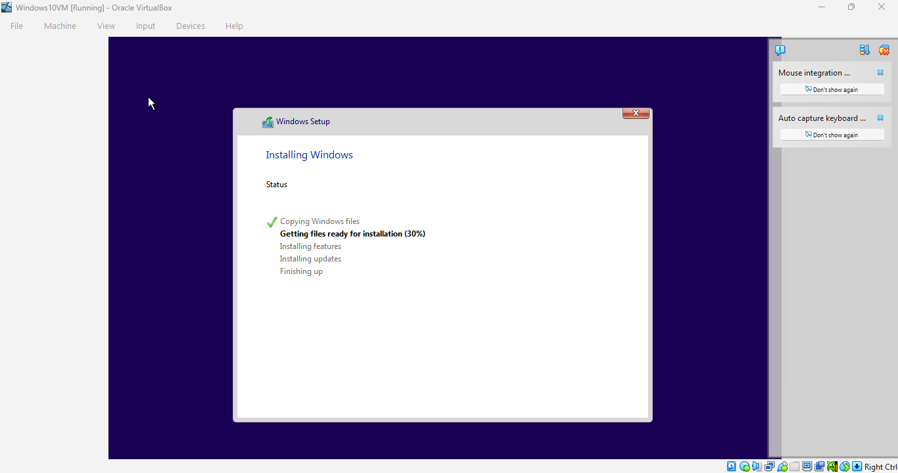
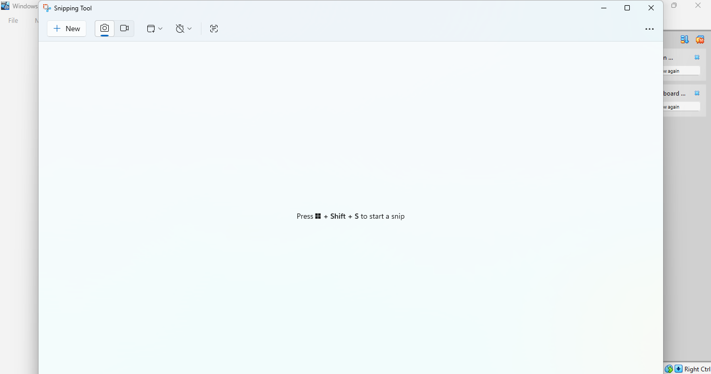
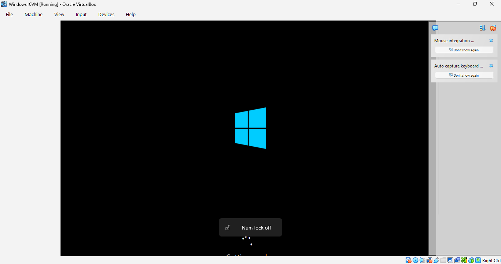

# Windows Installation Lab

## Objective
Install and configure a Windows virtual machine for IT support practice.

## Tools Used
- VirtualBox or VMware
- Windows 10/11
- System Settings
- User Accounts

## Steps Taken
1. Downloaded and installed Oracle VirtualBox.
2. Downloaded the Windows 10 ISO file.
3. Created a new virtual machine in VirtualBox.
4. Allocated system resources including RAM and storage.
5. Attached the Windows 10 ISO to the virtual optical drive.
6. Started the virtual machine and launched the Windows installation process.
7. Completed the Windows setup and initial configuration.
8. Verified successful installation by booting into the Windows desktop.
9. Used the Snipping Tool to capture screenshots for documentation.
10. Organized screenshots and documentation inside the GitHub repository.

## Screenshots
### Windows Installation Progress

---

### Snipping Tool Verification

---

### First Boot

---

### Windows Desktop Successfully Installed

## Troubleshooting Notes
### Issue: Virtual machine would not detect installation media
- Verified the Windows ISO was attached to the virtual optical drive.
- Restarted the virtual machine after correcting storage settings.

### Issue: Limited disk space on host machine
- Moved installation files and VM-related content to an external hard drive to free up storage.

### Issue: Screenshot documentation organization
- Renamed screenshots with standardized naming conventions for easier GitHub integration and readability.

### Issue: GitHub images not displaying initially
- Corrected screenshot file paths inside the README.md file.
- Ensured image file names matched the markdown links exactly.

## What I Learned
- How to create and configure a virtual machine using Oracle VirtualBox.
- How to install a Windows operating system from an ISO image.
- Basic virtual machine resource allocation concepts.
- How virtualization can be used for IT labs, testing, and troubleshooting.
- The importance of organized documentation and screenshot management.
- Basic Git and GitHub workflow including commits, pushes, and README formatting.
- How markdown image linking works within GitHub repositories.