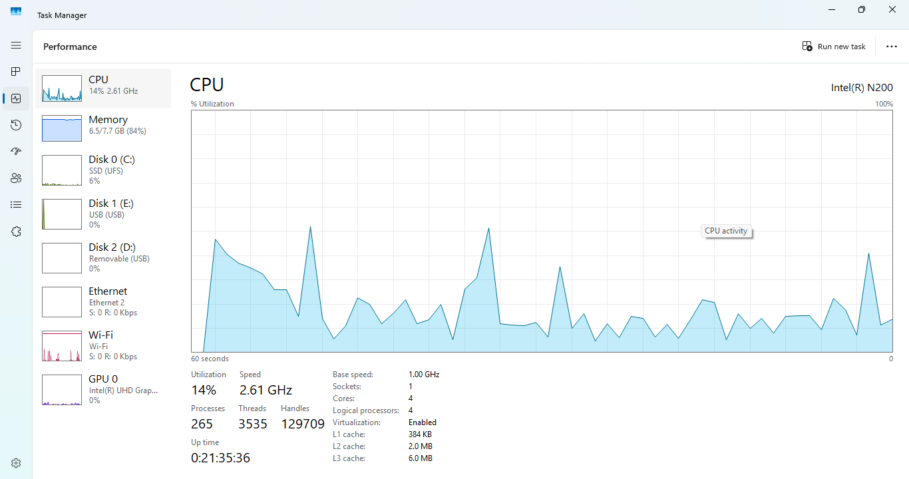
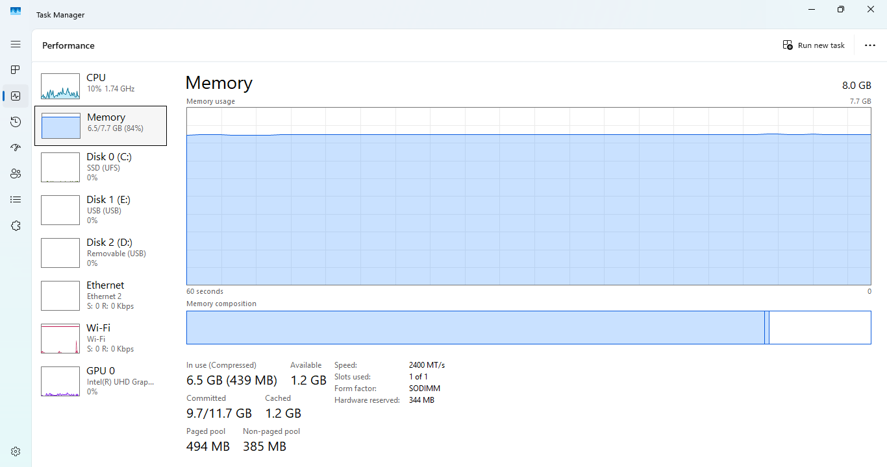
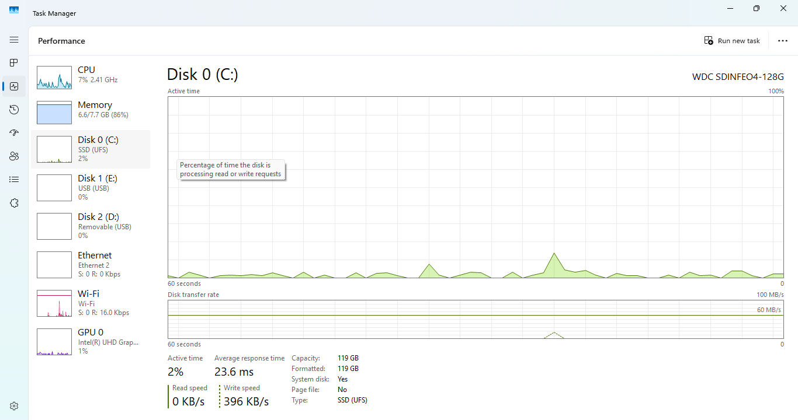
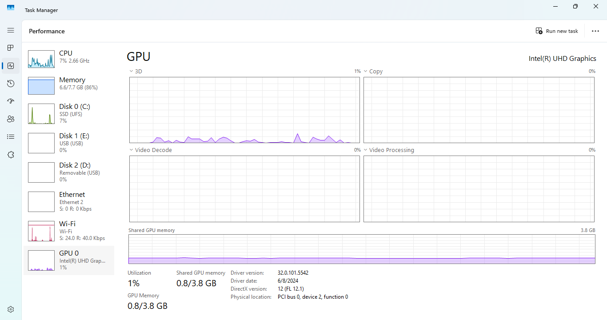
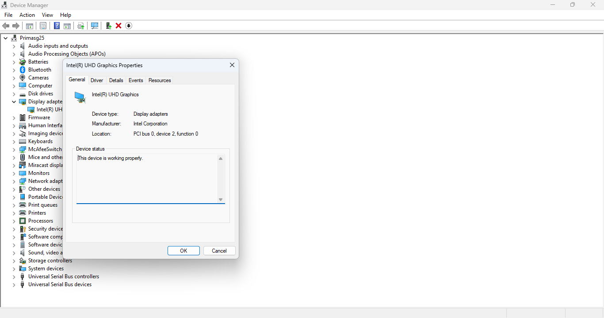
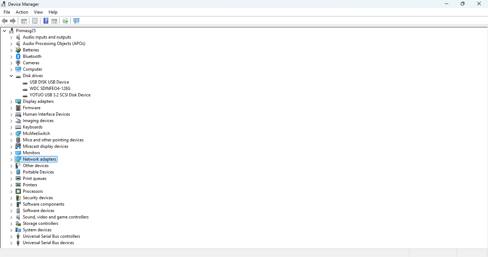
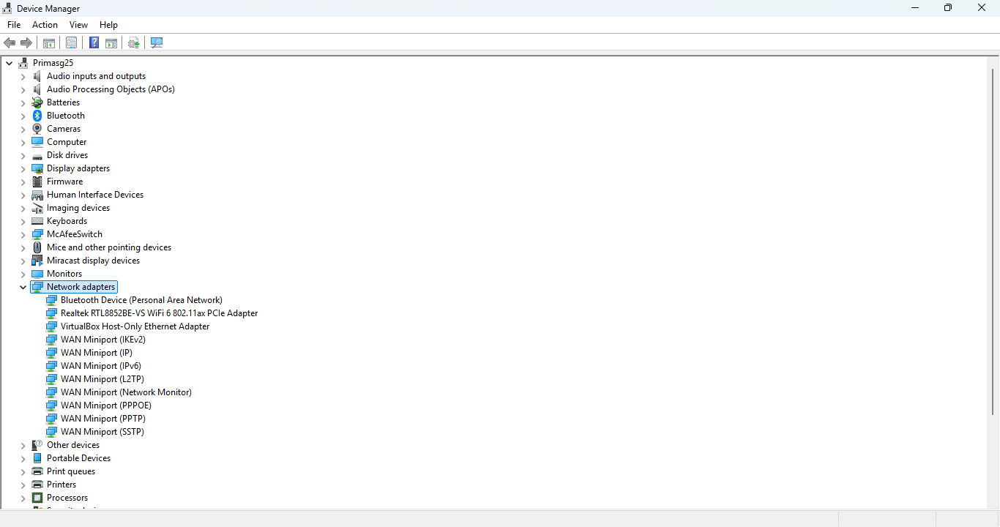
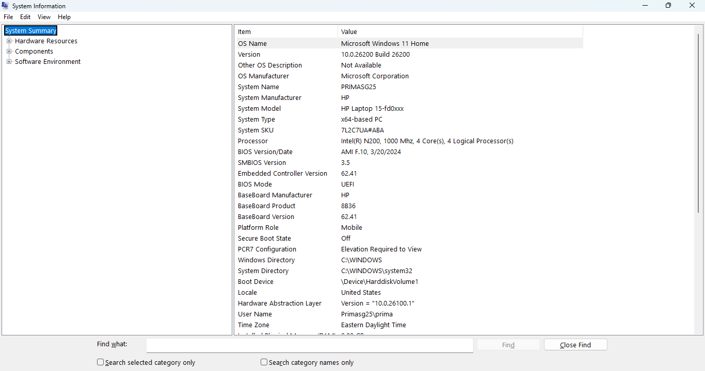
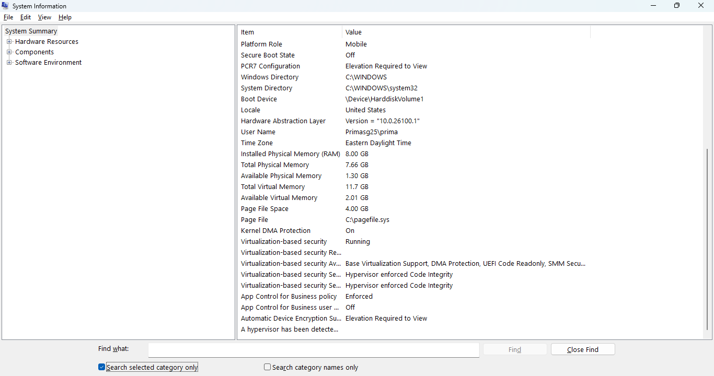
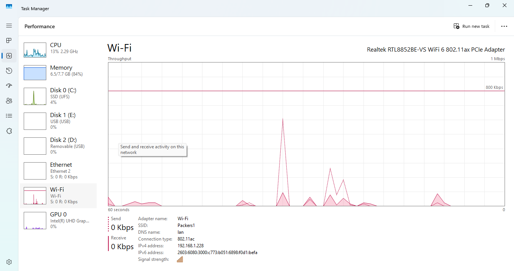

# Hardware Identification Lab

## Objective
Identify and document common laptop hardware components and system information using built-in Windows tools.

## Tools Used
- Windows 11
- Task Manager
- Device Manager
- System Information (msinfo32)
- GitHub
- Visual Studio Code

## Skills Practiced
- Hardware identification
- Windows system navigation
- Device Manager usage
- System diagnostics
- Documentation
- Screenshot organization

## Hardware Components Identified

| Component | Purpose |
|---|---|
| CPU | Processes instructions and calculations |
| RAM | Temporary memory for active applications |
| Storage Drive | Stores operating system and files |
| GPU | Handles graphics and video rendering |
| Network Adapter | Enables network and internet connectivity |
| Wi-Fi Adapter | Enables wireless communication |
| BIOS/System Information | Provides low-level hardware and firmware details |

---

# Screenshots

## CPU Information

---

## RAM Information

---

## Storage Information

---

## GPU Information

---

## Display Adapter Information

---

## Disk Drive Information

---

## Network Adapter Information

---

## Processor Information

---

## System Information Overview

---

## Wi-Fi Information

---

## Steps Taken

1. Opened Task Manager and reviewed hardware performance tabs.
2. Identified CPU, RAM, disk, GPU, and Wi-Fi hardware information.
3. Opened Device Manager to identify installed hardware components.
4. Expanded hardware categories including processors, disk drives, and network adapters.
5. Used System Information (msinfo32) to gather additional system and BIOS details.
6. Captured screenshots for documentation purposes.
7. Organized screenshots into the lab folder structure.
8. Updated README documentation with findings and screenshots.

---

## Troubleshooting Notes

### Issue: Large System Information Window
- Captured the System Information window using two screenshots to ensure all important information was visible.

### Issue: Organizing Multiple Screenshots
- Used standardized file naming conventions to keep documentation organized and readable.

### Issue: GitHub Image Paths
- Verified screenshot file names matched markdown image links exactly to ensure proper rendering on GitHub.

---

## What I Learned

- How to identify hardware components using built-in Windows tools.
- How Device Manager organizes installed hardware.
- How to locate processor, storage, GPU, and network information.
- The importance of system documentation in IT support environments.
- How system information tools assist with troubleshooting and diagnostics.
- How to properly organize and document technical labs using GitHub and Markdown.

---

## Outcome

Successfully identified and documented major laptop hardware components and system information using native Windows utilities.