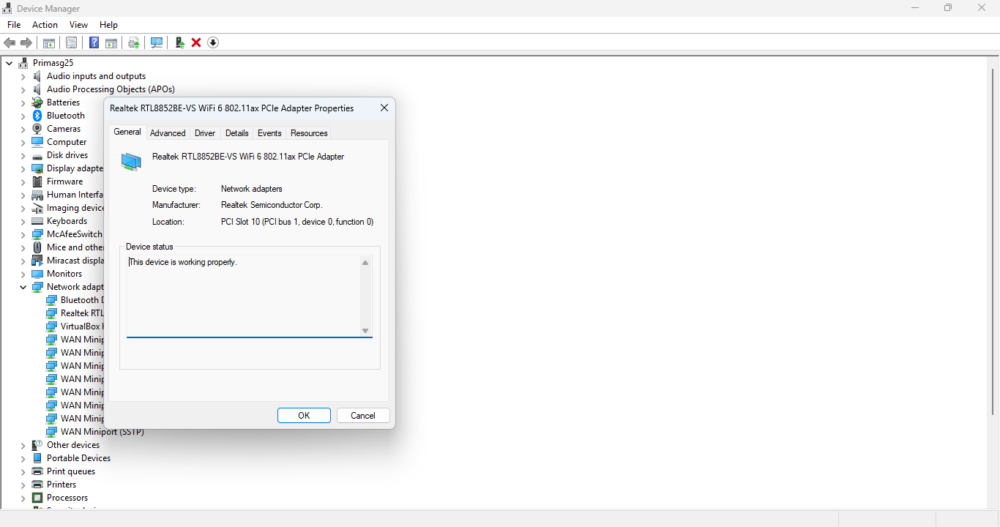
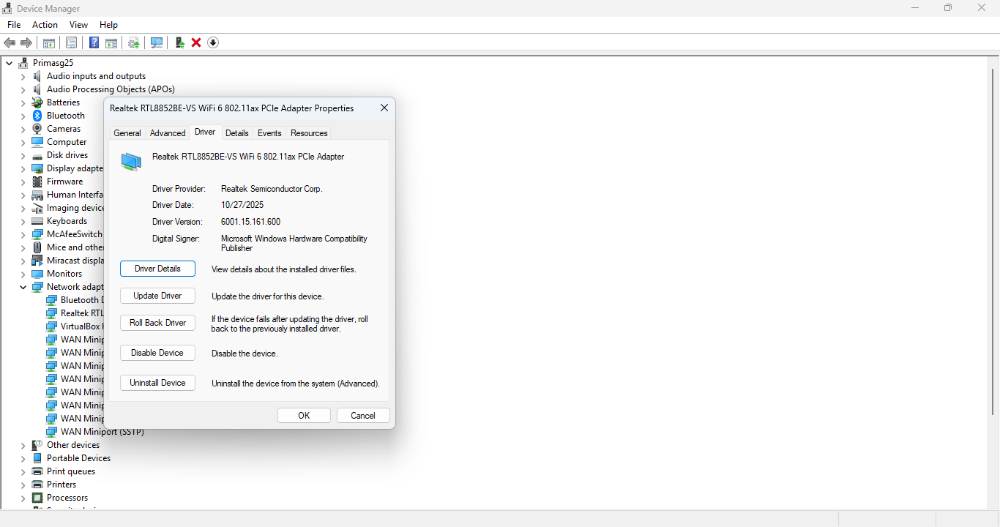
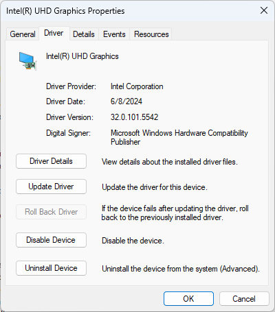
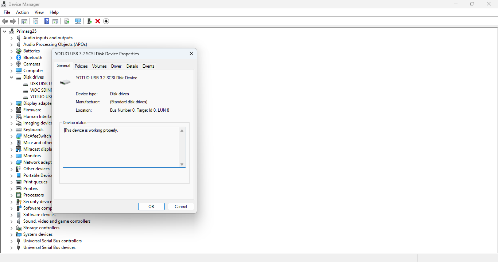
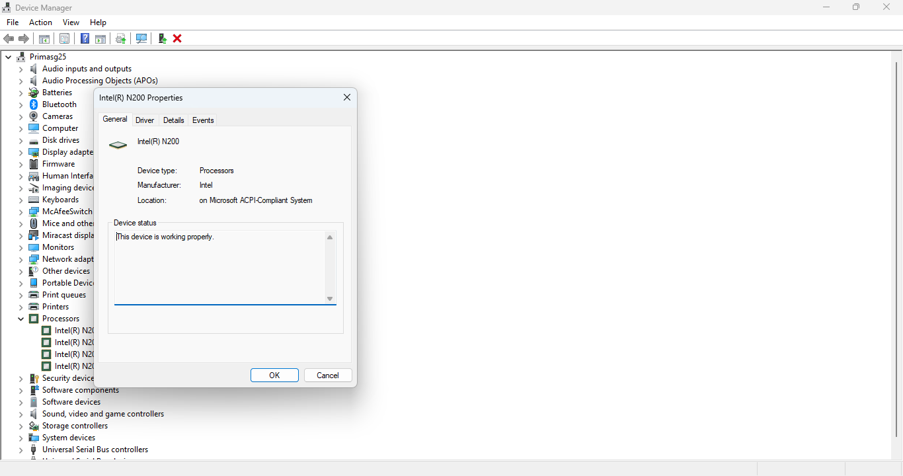
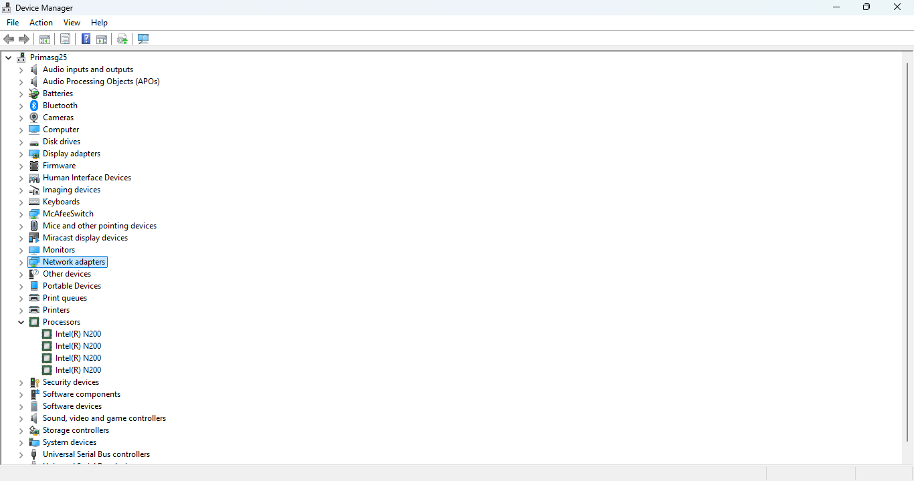

# Lab 15 – Windows Device Manager Troubleshooting Lab

## Objective

Explore Windows Device Manager and practice identifying hardware devices, reviewing driver information, and understanding basic troubleshooting tools available within Windows.

---

## Tools Used

- Windows 11
- Device Manager
- Task Manager
- System Information (msinfo32)
- GitHub
- Visual Studio Code

---

## Skills Practiced

- Hardware troubleshooting
- Driver management
- Device Manager navigation
- Windows diagnostics
- System documentation
- Technical troubleshooting workflows

---

## Troubleshooting Tasks Performed

- Reviewed installed hardware devices
- Opened device property windows
- Examined installed driver information
- Reviewed network adapter settings
- Identified storage devices
- Explored processor listings
- Verified display adapter functionality
- Practiced basic Device Manager navigation

---

# Screenshots

## Network Adapter Properties

---

## Network Driver Information

---

## Display Adapter Properties

---

## Display Driver Information

---

## Disk Drive Properties

---

## Processor List

---

## Installed Network Adapters

---

## Processor Devices

---

## Steps Taken

1. Opened Windows Device Manager.
2. Expanded hardware categories including:
   - Network adapters
   - Disk drives
   - Display adapters
   - Processors
3. Opened device property windows for multiple hardware components.
4. Reviewed installed driver information for network and display adapters.
5. Examined driver provider, version, and installation details.
6. Verified hardware devices were functioning properly.
7. Captured screenshots for documentation purposes.
8. Organized screenshots into the GitHub lab folder structure.
9. Updated README documentation using Markdown formatting.

---

## Troubleshooting Notes

### Issue: Large Device Manager Windows
- Resized and repositioned property windows to improve screenshot readability.

### Issue: Multiple Processor Entries
- Observed that Windows lists logical processors/threads separately within Device Manager.

### Issue: Driver Identification
- Verified installed drivers using the Driver tab inside device properties.

### Issue: Screenshot Organization
- Used standardized file naming conventions to maintain clean documentation and proper GitHub image rendering.

---

## What I Learned

- How Windows Device Manager organizes hardware devices.
- How to access and review hardware properties.
- How to locate installed driver information.
- The importance of driver management in troubleshooting.
- How Windows identifies network, storage, processor, and display hardware.
- Basic troubleshooting workflows used in IT support environments.
- How to document technical findings using GitHub and Markdown.

---

## Outcome

Successfully explored Windows Device Manager and documented hardware properties, driver information, and troubleshooting tools using native Windows utilities.