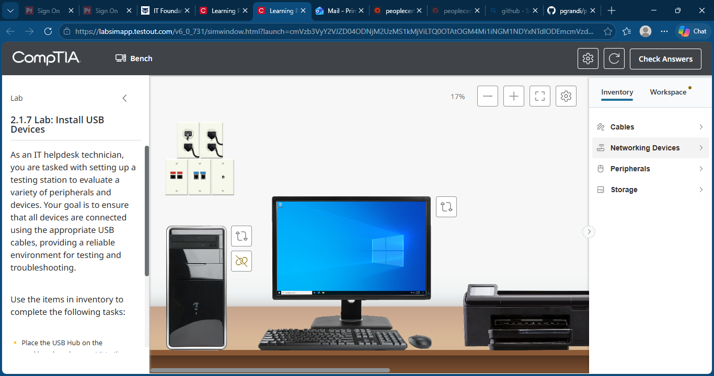
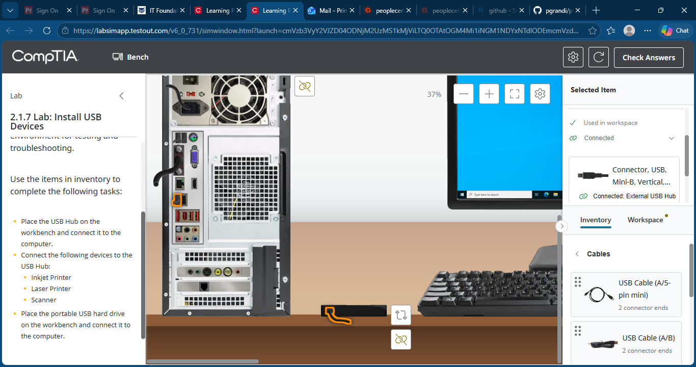
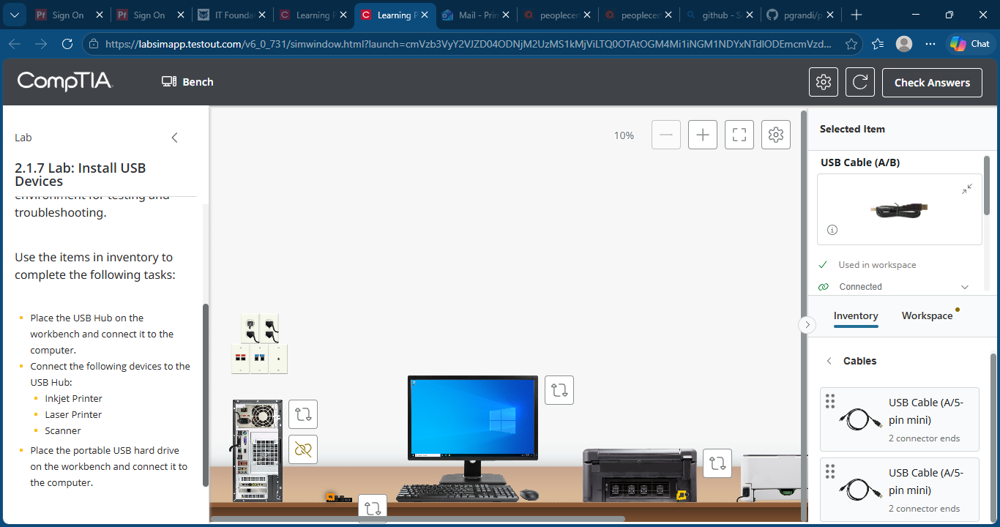
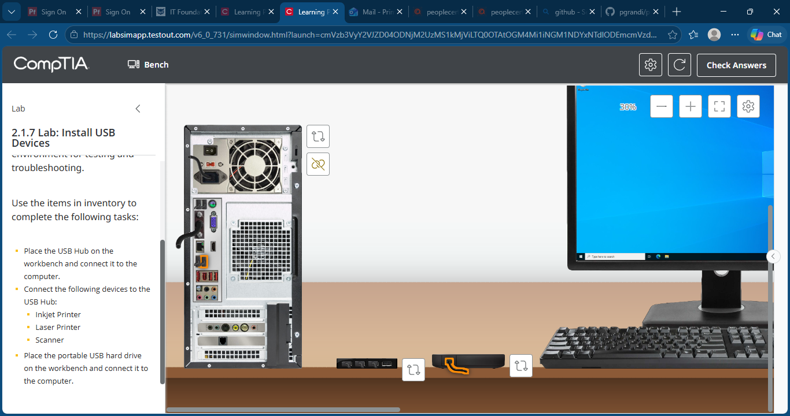

# Lab 05: Install USB Devices

## Objective

As an IT Help Desk Technician, install and connect USB devices using the appropriate USB interfaces and cables. Verify that peripherals are connected correctly to a USB hub and computer workstation.

## Skills Demonstrated

- USB device installation
- Peripheral connectivity
- USB hub configuration
- Hardware troubleshooting
- Device interface identification
- End-user workstation setup

## Lab Tasks

Completed the following tasks:

1. Connected a USB hub to the computer.
2. Connected an inkjet printer to the USB hub.
3. Connected a laser printer to the USB hub.
4. Connected a scanner to the USB hub.
5. Connected a portable USB hard drive directly to the computer.

## Technologies Used

- TestOut LabSim
- Windows Workstation
- USB Hub
- Inkjet Printer
- Laser Printer
- Scanner
- External USB Hard Drive

## Screenshots

### Initial Lab Environment

### USB Hub Connected to Computer

### Printers and Scanner Connected to USB Hub

### Portable USB Hard Drive Connected

## Key Takeaways

- Identified appropriate USB connectors for various devices.
- Connected multiple peripherals through a USB hub.
- Demonstrated proper workstation hardware installation procedures.
- Reinforced foundational CompTIA A+ hardware objectives.