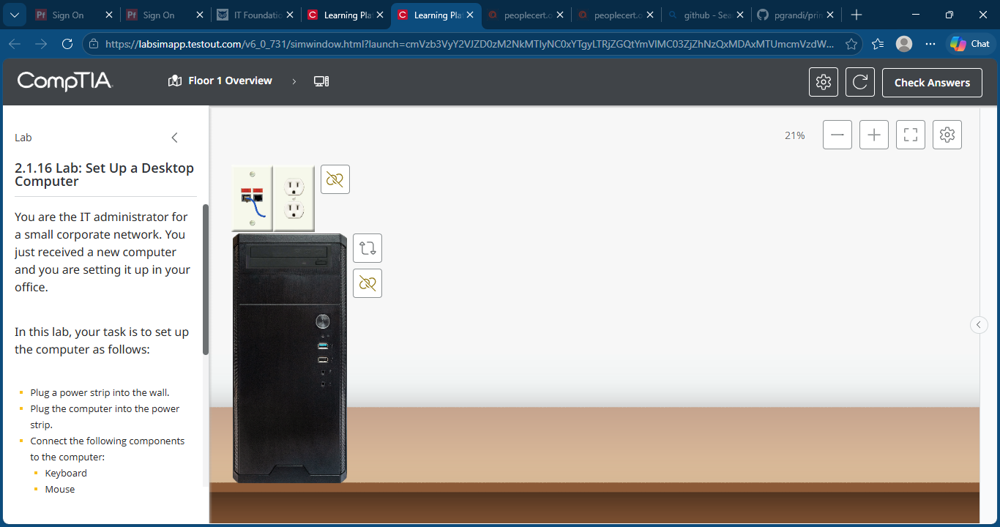
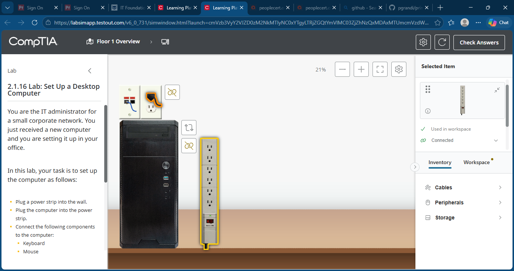
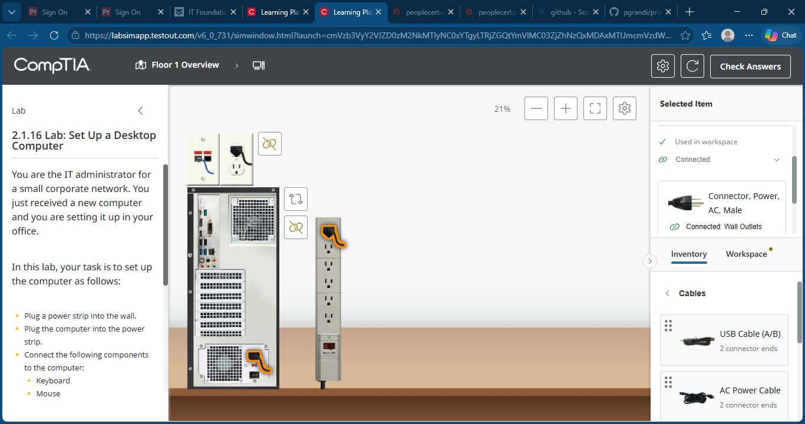
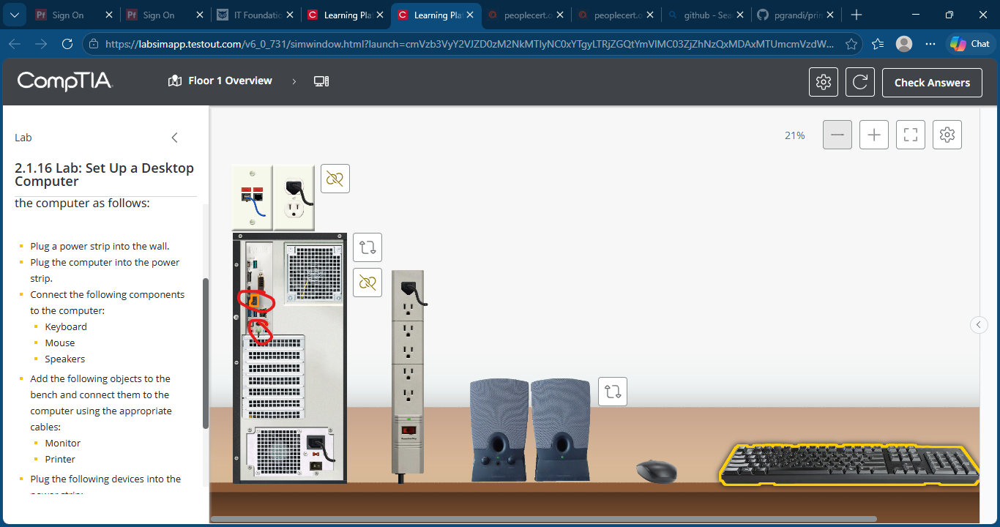
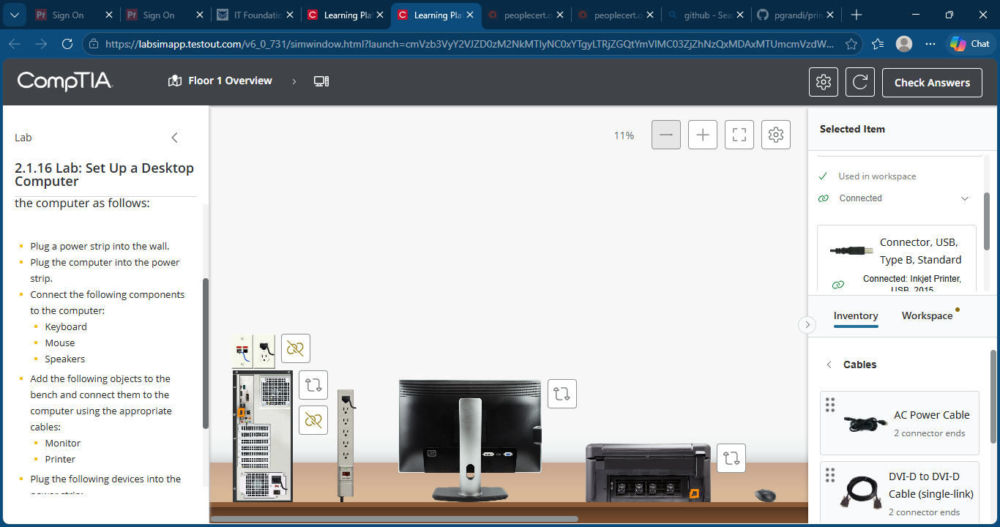
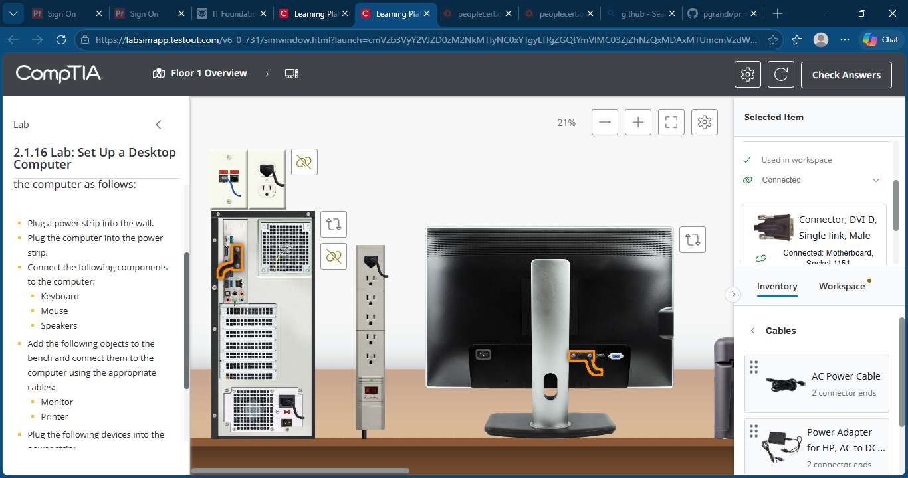
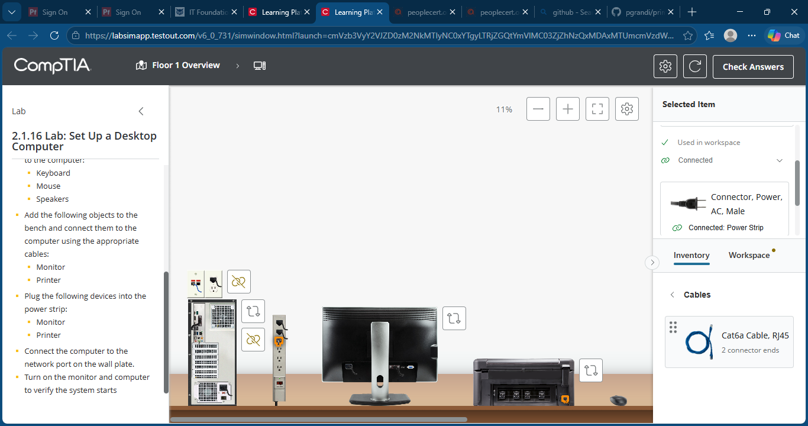
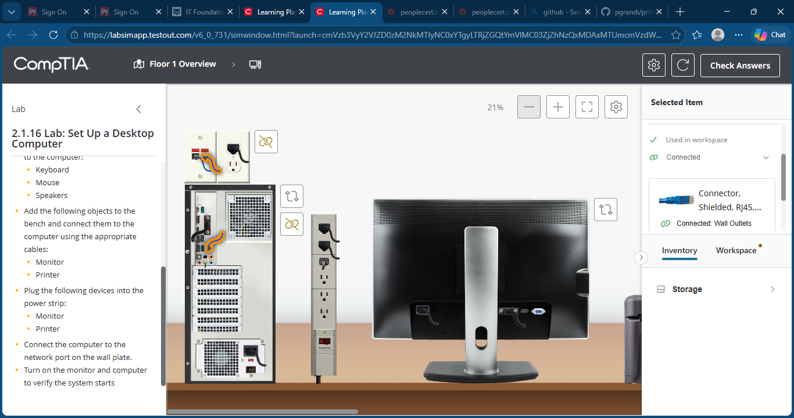
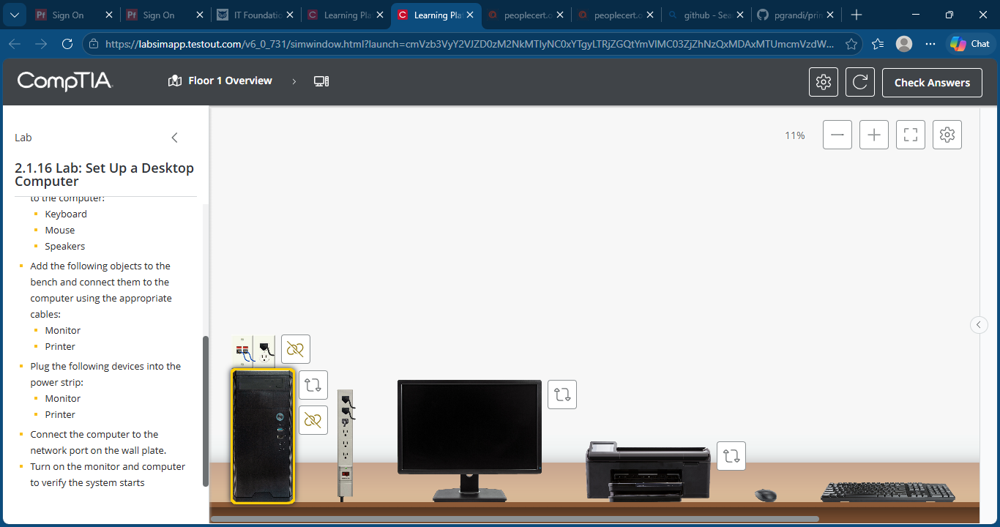
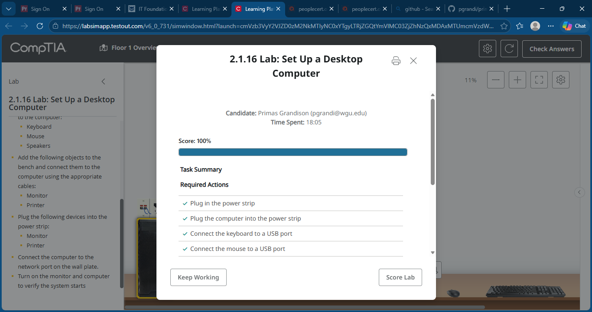

# Lab 06: Set Up a Desktop Computer

## Objective

Configure a new desktop workstation for use on a corporate network. Install and connect all required peripherals, power devices, and establish network connectivity.

## Skills Demonstrated

- Desktop workstation deployment
- Peripheral installation
- Power distribution setup
- Network connectivity
- Hardware configuration
- IT support fundamentals
- End-user workstation setup

## Lab Tasks

Completed the following tasks:

1. Connected a power strip to a wall outlet.
2. Connected the desktop computer to the power strip.
3. Connected a keyboard to a USB port.
4. Connected a mouse to a USB port.
5. Connected speakers to the appropriate audio ports.
6. Connected a monitor to the computer using the correct video cable.
7. Connected a printer to the computer.
8. Connected the monitor to the power strip.
9. Connected the printer to the power strip.
10. Connected the computer to the network wall jack.
11. Verified proper workstation setup and operation.

## Technologies Used

- TestOut LabSim
- Desktop Workstation
- Monitor
- Printer
- Keyboard
- Mouse
- Speakers
- Power Strip
- Ethernet Network Connection

## Screenshots

### Initial Lab Environment

### Power Strip Installed

### Computer Connected to Power Strip

### Keyboard, Mouse, and Speakers Connected

### Printer Connected

### Monitor Connected

### Monitor Connected to Power

### Printer Connected to Power

### Network Connection Established

### Completed Workstation Setup

### Lab Completion

## Key Takeaways

- Practiced complete workstation deployment procedures.
- Identified appropriate power, video, USB, audio, and network connections.
- Reinforced hardware installation and configuration skills.
- Gained hands-on experience with common IT support tasks performed during employee workstation setup.