# Lab 07: Choose and Install a Motherboard

## Objective

Select and install the correct motherboard based on system requirements. Connect all required motherboard power connectors, front panel connectors, fans, and USB headers.

## Skills Demonstrated

- Motherboard installation
- Front panel connector installation
- Power supply connections
- CPU power configuration
- USB header installation
- Internal PC hardware configuration
- Hardware compatibility verification
- Desktop repair fundamentals

## Lab Tasks

Completed the following tasks:

1. Selected the correct Intel Socket 1151 motherboard.
2. Installed the motherboard into the system case.
3. Connected the CPU power connector.
4. Connected the main motherboard power connector.
5. Connected front panel audio.
6. Connected USB 2.0 header.
7. Connected USB 3.0 header.
8. Connected power switch connector.
9. Connected power LED connector.
10. Connected HDD LED connector.
11. Connected internal speaker connector.
12. Connected system fan headers.

## Technologies Used

- TestOut LabSim
- ATX Desktop Case
- Intel Socket 1151 Motherboard
- Power Supply Unit (PSU)
- USB 2.0 Headers
- USB 3.0 Headers
- Front Panel Connectors
- Internal Cooling Fans

## Screenshots

### Initial Lab Environment

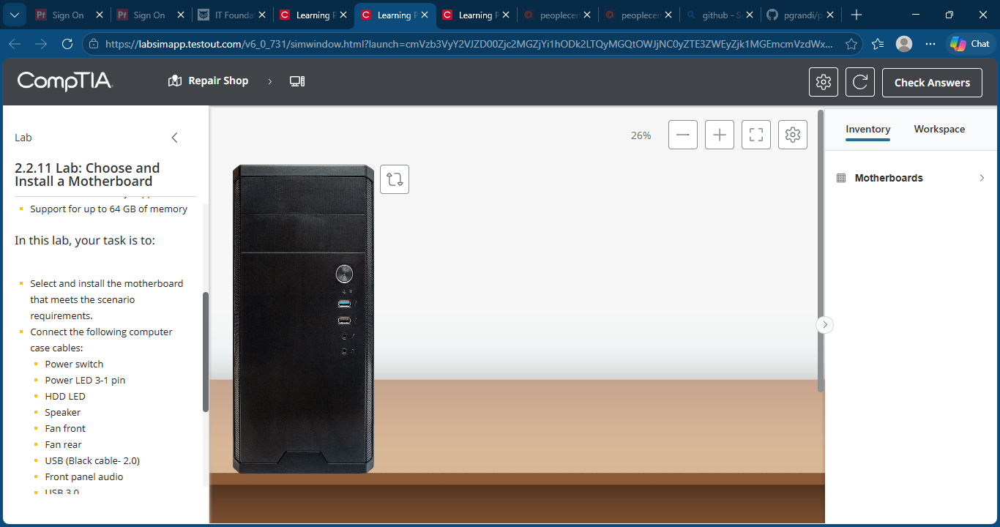

### Correct Motherboard Installed

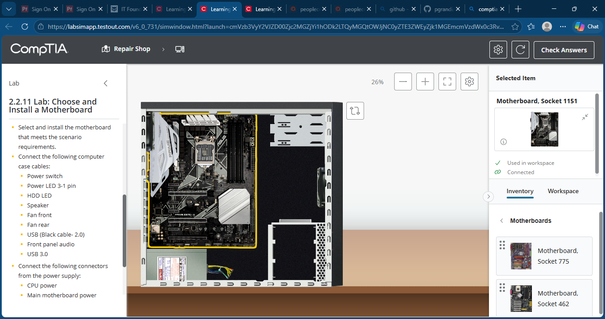

### CPU Power Connected

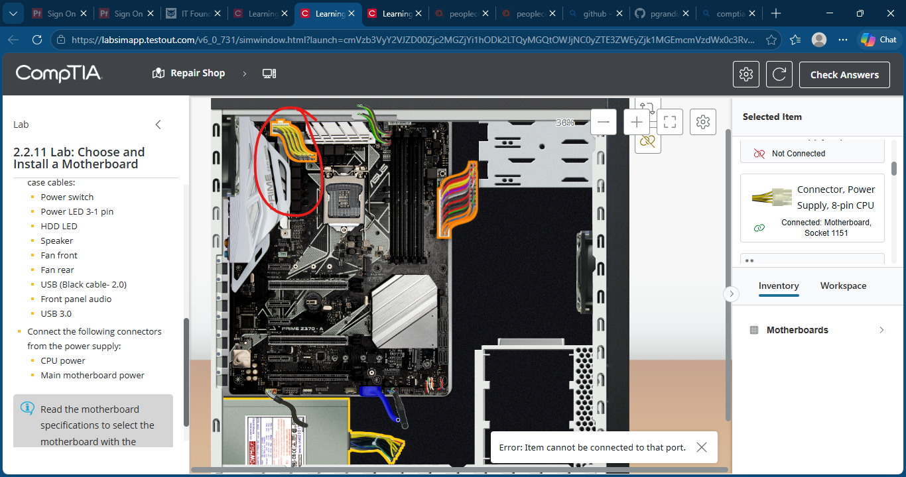

### Fan Header Connected

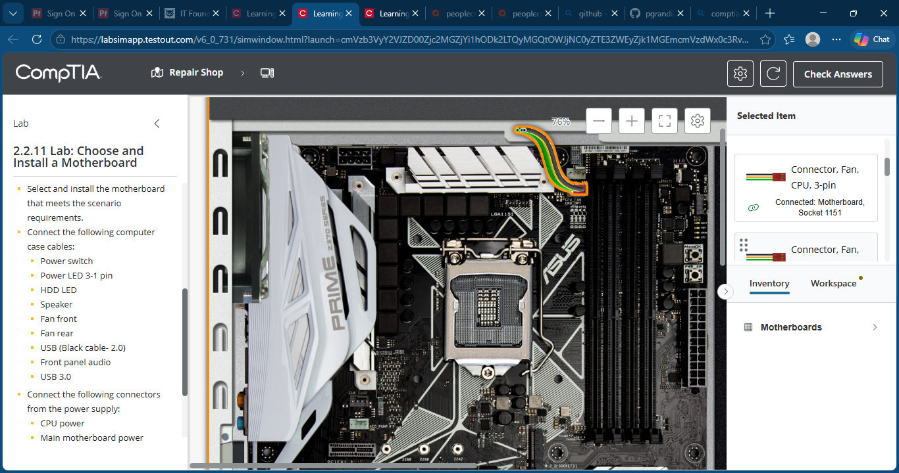

### Front Panel Audio Connected

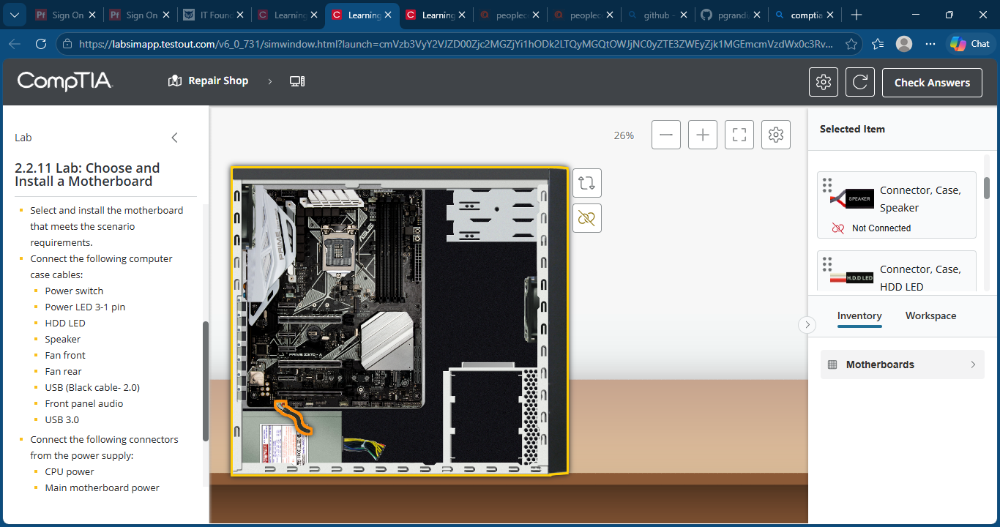

### HDD LED Connected

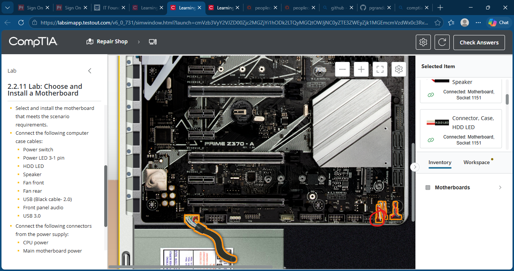

### Main Motherboard Power Connected

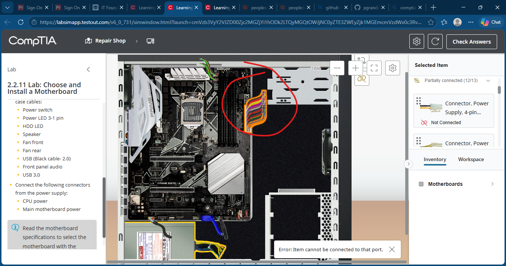

### Power LED Connected

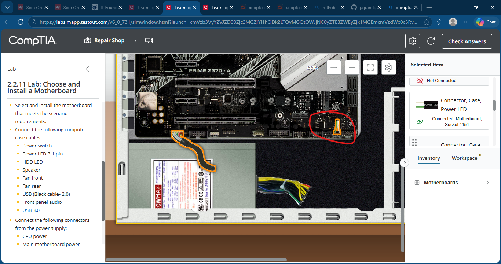

### Power Switch Connected

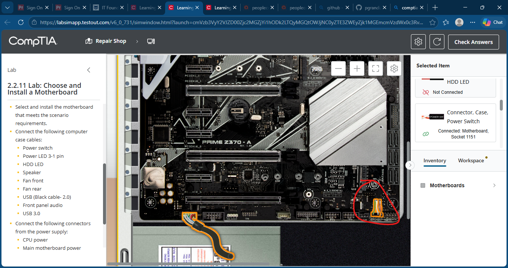

### Speaker Connected

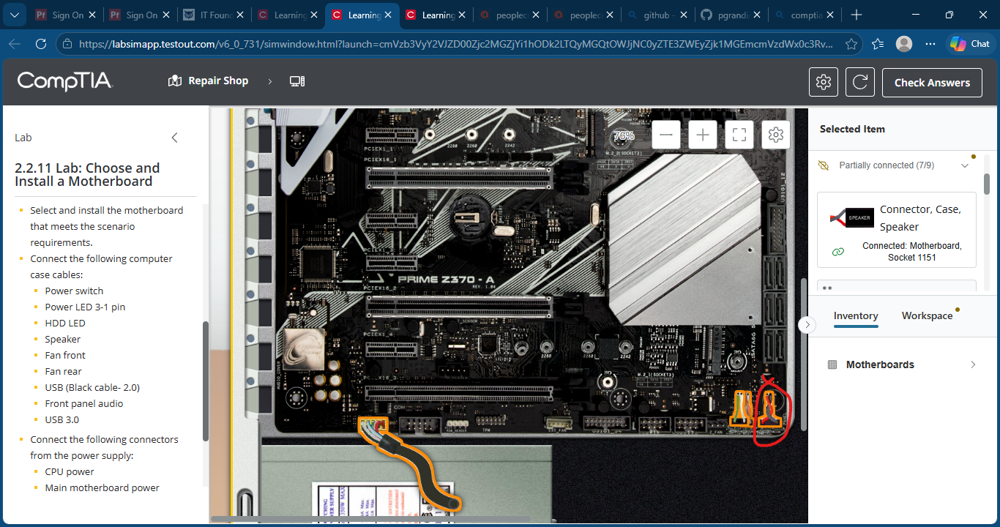

### USB Header Connected

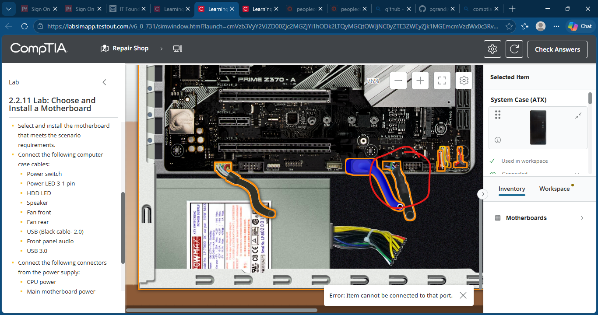

### USB 3.0 Header Connected

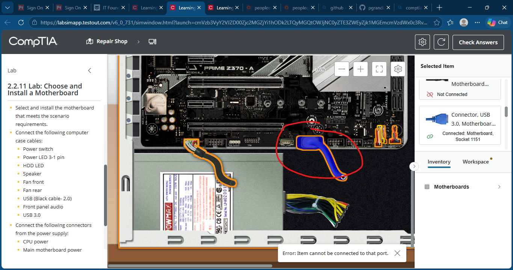

### Lab Completion

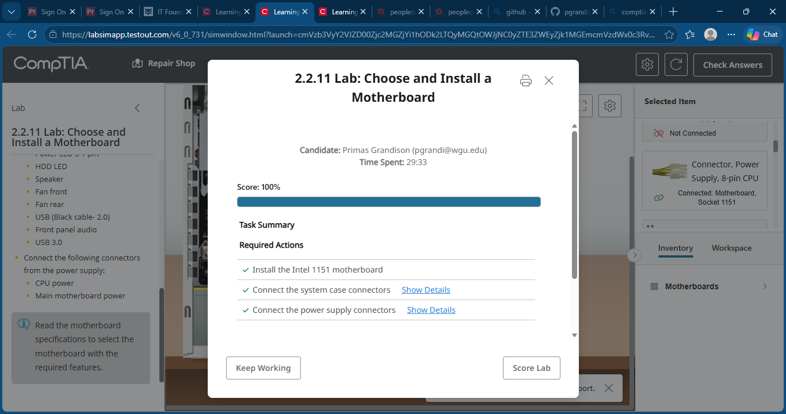

## Key Takeaways

- Practiced selecting compatible motherboard hardware.
- Learned proper motherboard power and front panel connector placement.
- Reinforced understanding of internal desktop PC components.
- Gained hands-on experience with motherboard installation and hardware assembly procedures.