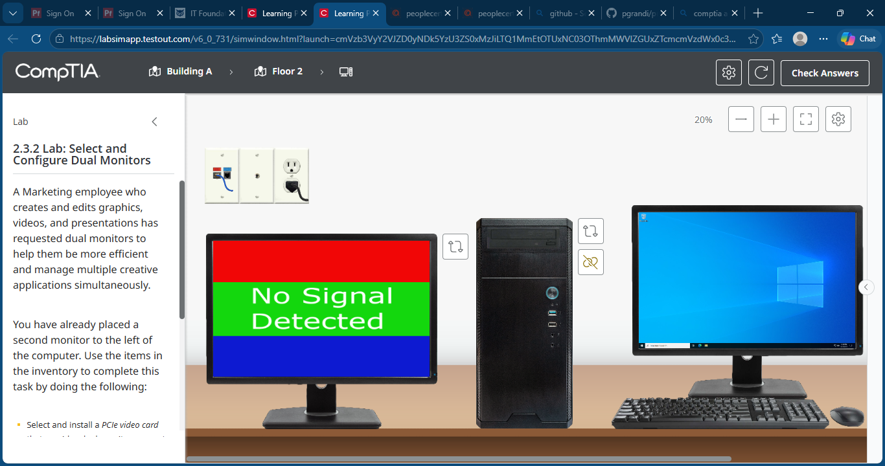
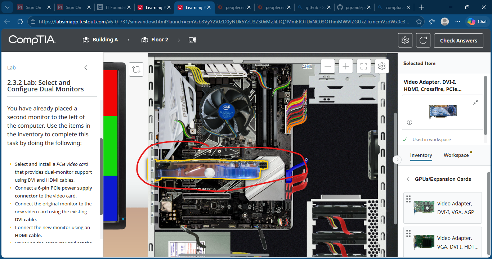
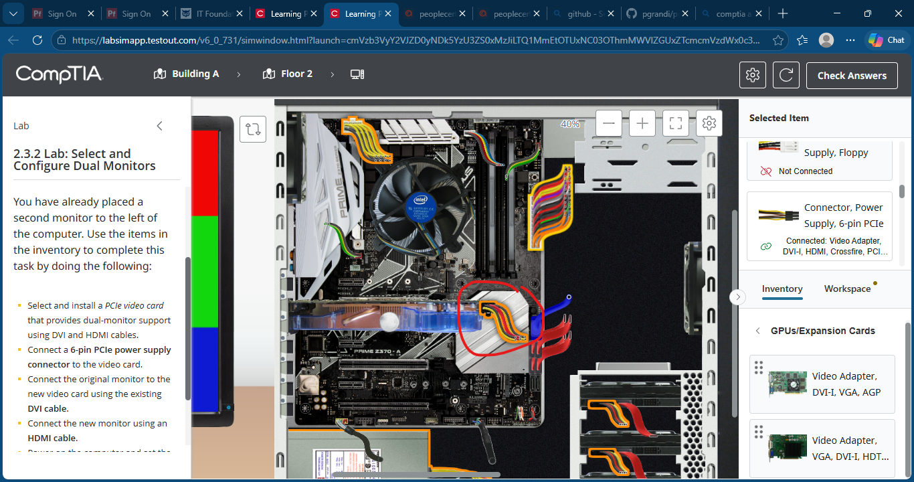
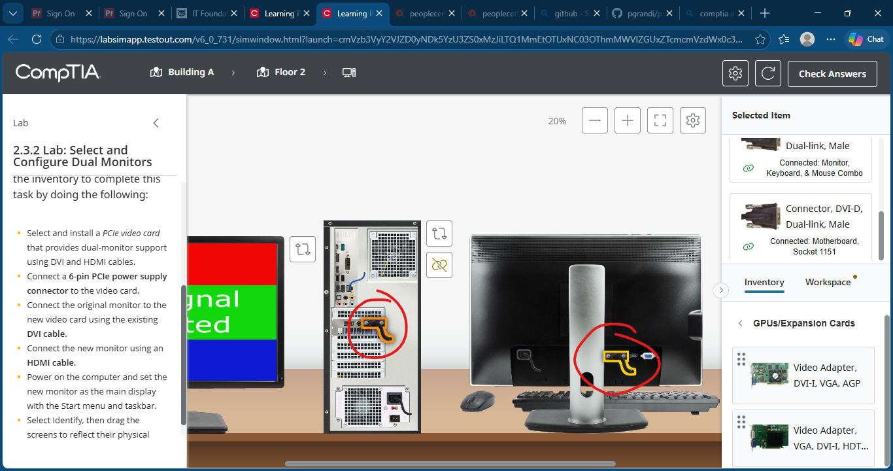
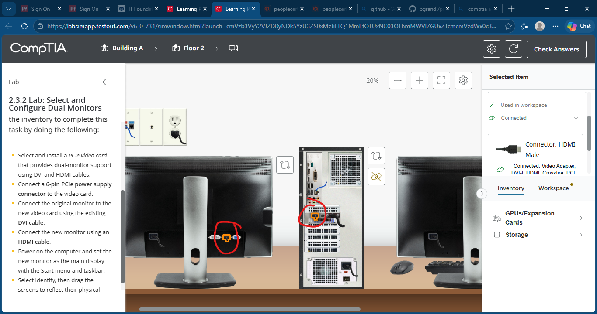
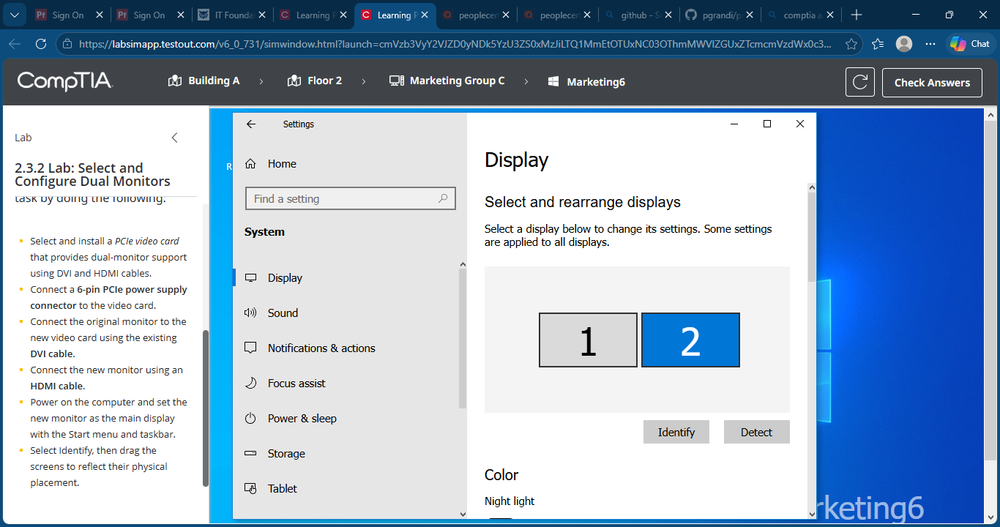
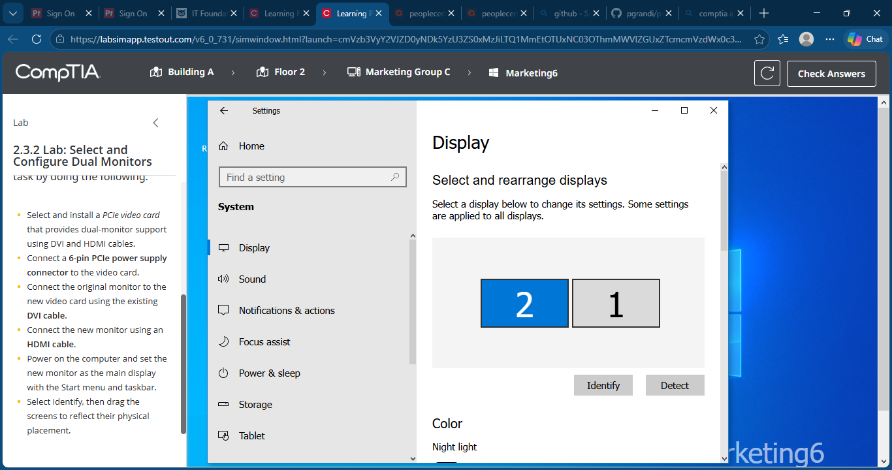
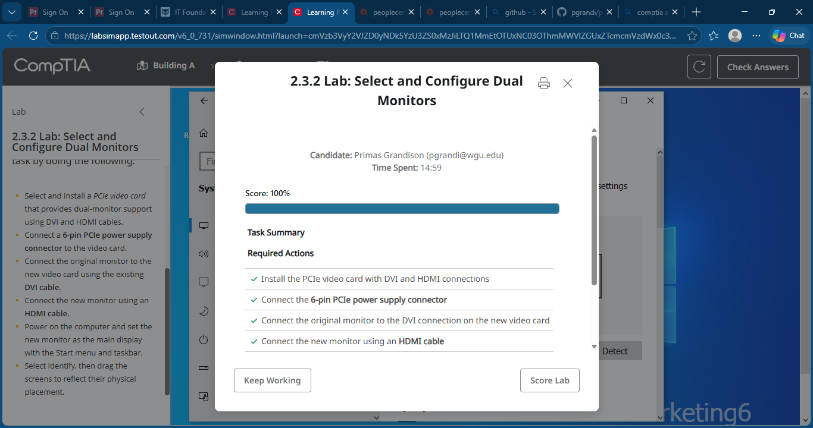

# Lab 09: Select and Configure Dual Monitors

## Objective

Install and configure a dual-monitor workstation by installing a PCIe graphics card with DVI and HDMI outputs, connecting both monitors, configuring display settings, and arranging the monitors correctly within Windows.

## Skills Demonstrated

- Dual-monitor configuration
- PCIe graphics card installation
- HDMI and DVI display connections
- GPU power connections
- Windows display configuration
- Multi-display management
- Hardware installation and setup
- Display arrangement and troubleshooting

## Lab Tasks

Completed the following tasks:

1. Installed a PCIe graphics card with DVI and HDMI outputs.
2. Connected the 6-pin PCIe power supply connector to the GPU.
3. Connected the original monitor using the existing DVI cable.
4. Connected the second monitor using an HDMI cable.
5. Configured the new monitor as the primary display.
6. Rearranged monitor positions in Windows Display Settings.
7. Verified successful dual-monitor operation.

## Technologies Used

- TestOut LabSim
- PCIe Graphics Card
- HDMI Cable
- DVI Cable
- Windows 10 Display Settings
- Dual-Monitor Workstation
- ATX Desktop Computer

## Screenshots

### Initial Lab Setup

### Installing the PCIe Video Card

### Connecting PCIe Power Supply

### Original Monitor Connected Using DVI

### New Monitor Connected Using HDMI

### Setting the New Monitor as the Main Display

### Rearranging Monitor Placement

### Lab Completion

## Key Takeaways

- Learned how to install and power a PCIe graphics card.
- Practiced connecting displays using both DVI and HDMI interfaces.
- Configured a multi-monitor workstation in Windows.
- Reinforced understanding of display arrangement and primary monitor settings.
- Gained practical experience with workstation hardware upgrades and productivity-focused configurations.