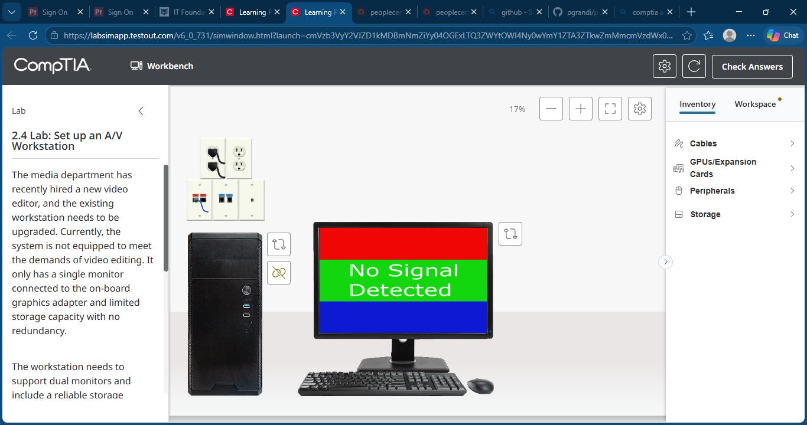
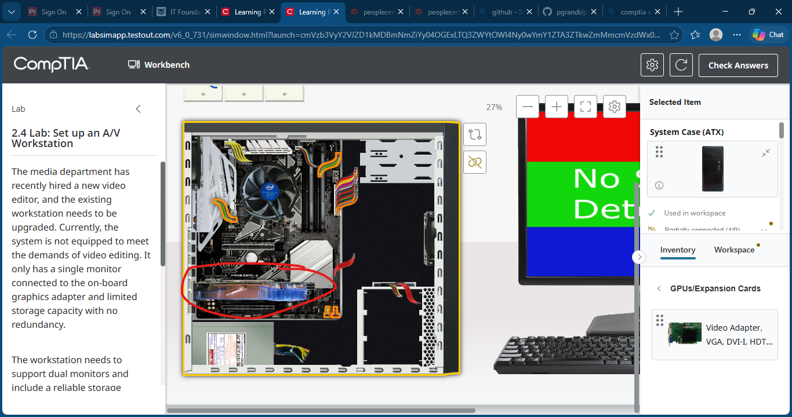
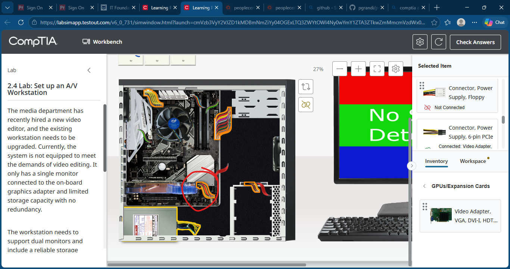
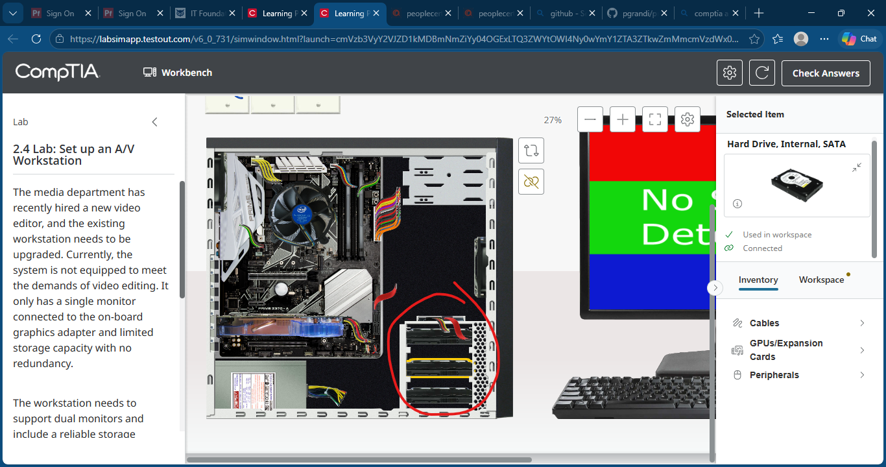
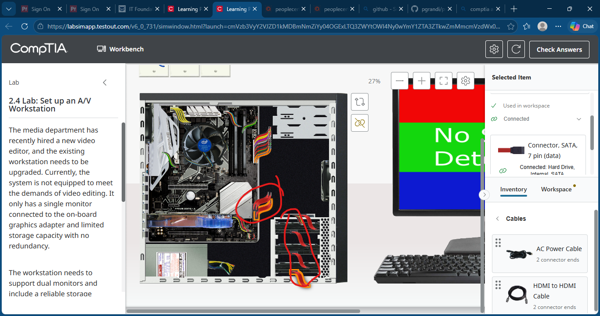
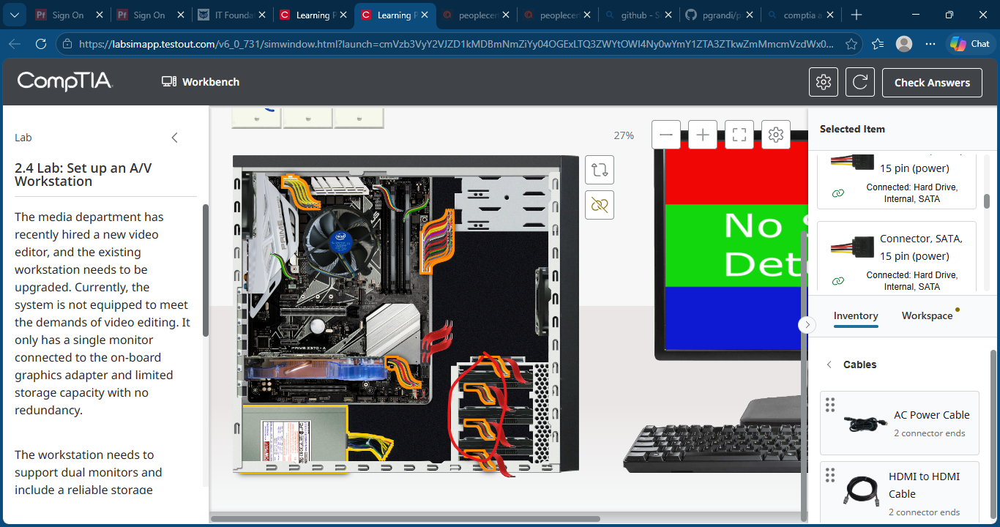
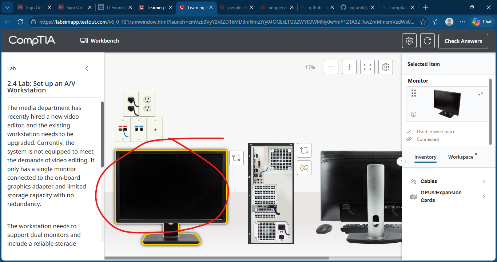
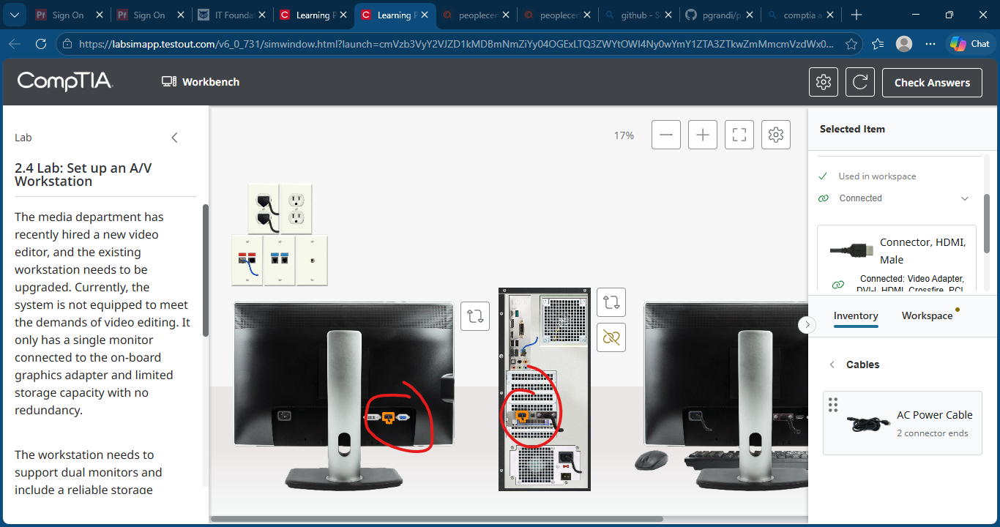
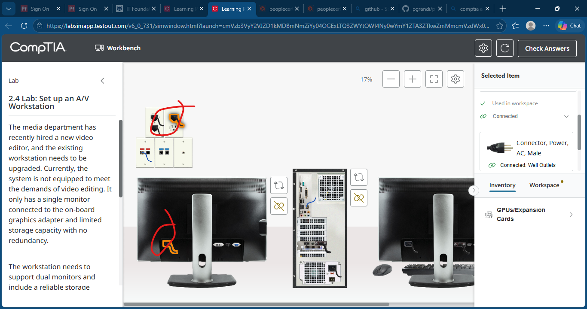
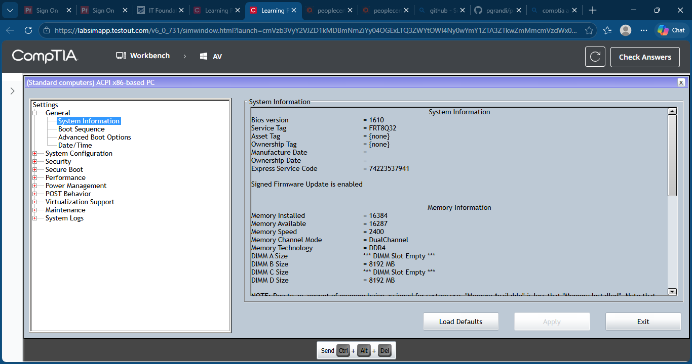

# Lab 10: Set Up an A/V Workstation

## Objective

Upgrade a workstation for video editing by installing a dual-monitor capable graphics card, adding redundant storage, configuring RAID, and connecting multiple displays.

## Skills Demonstrated

- PCIe graphics card installation
- GPU power connections
- Multi-monitor workstation setup
- SATA storage installation
- RAID configuration
- BIOS configuration
- Disk Management
- HDMI and DVI connectivity
- Storage redundancy implementation

## Lab Tasks

Completed the following tasks:

1. Installed a dual-monitor capable PCIe graphics card.
2. Connected the required 6-pin PCIe power connector.
3. Installed three additional SATA hard drives.
4. Connected SATA data cables.
5. Connected SATA power cables.
6. Moved the original monitor connection from onboard graphics to the new graphics card.
7. Added and connected a second monitor.
8. Connected the second monitor using HDMI.
9. Connected power to the new monitor.
10. Entered BIOS and configured SATA mode for RAID.
11. Created a RAID 5 volume.
12. Selected the required disks for the RAID array.
13. Confirmed RAID volume creation.
14. Verified the RAID array in Windows Disk Management.
15. Confirmed successful workstation upgrade.

## Technologies Used

- TestOut LabSim
- PCIe Graphics Card
- HDMI
- DVI
- SATA Storage
- RAID 5
- BIOS Configuration Utility
- Windows Disk Management
- Dual-Monitor Workstation

## Screenshots

### Initial Lab Setup

### Install Graphics Card

### Connect PCIe Power

### Install Additional Hard Drives

### Install SATA Data Cables

### Install SATA Power Connectors

### Move DVI Connection to Graphics Card

### Add Second Monitor

### Connect HDMI Cable

### Connect Monitor Power

### Configure RAID in BIOS

### Create RAID Volume

### Select RAID Disks

### Confirm RAID Volume

### Verify in Disk Management

### Lab Completed

## Key Takeaways

- Installed and configured a dedicated graphics card for video editing workloads.
- Configured dual-monitor support using DVI and HDMI.
- Installed multiple SATA hard drives.
- Connected SATA data and power cables.
- Configured RAID 5 storage through BIOS.
- Verified RAID functionality within Windows.
- Learned how workstation-class systems combine graphics performance and storage redundancy for professional media production environments.