# Lab 12: Troubleshoot Power Supply Problems

## Objective
Diagnose a computer that fails to power on, test the power supply using a PSU tester, replace the faulty unit, reconnect all required power connections, and verify successful system startup.

---

## Lab Steps

### 1. Verify the Issue
Attempted to power on the computer and confirmed that the system failed to start.

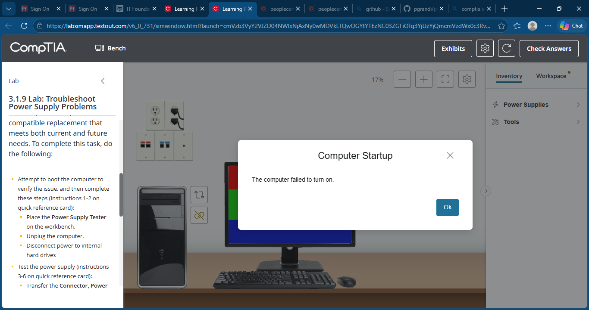

---

### 2. Connect the Power Supply Tester
Placed the power supply tester on the workbench and disconnected power from the internal drives.

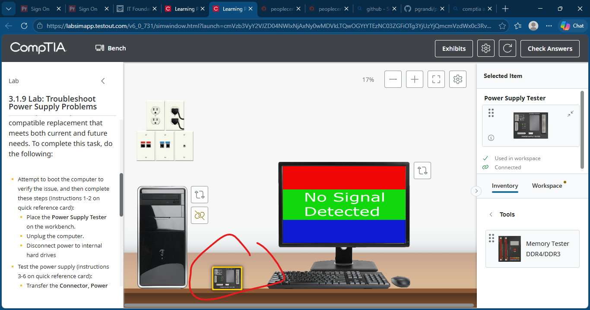

---

### 3. Test the Main Motherboard Connector
Connected the 20+4-pin ATX motherboard power connector to the tester.

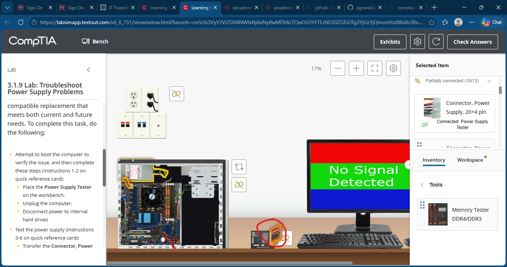

---

### 4. Test the CPU Power Connector
Connected the CPU power connector to the tester.

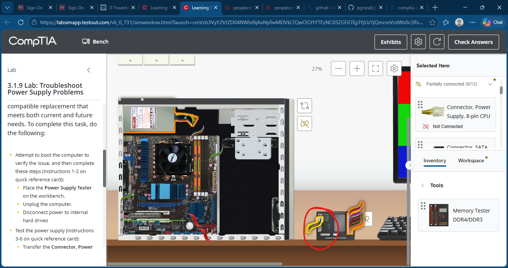

---

### 5. Test SATA Power Connectors
Connected the SATA power cable to the tester.

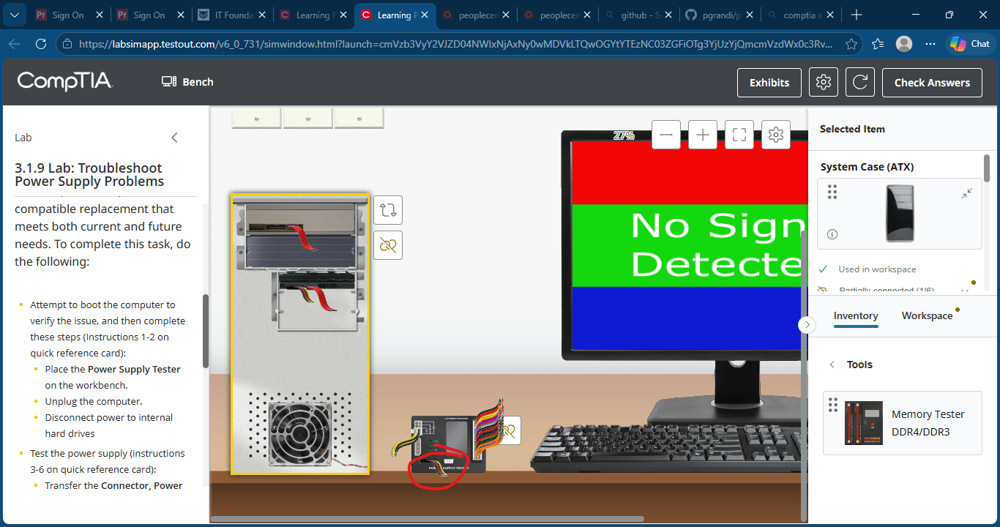

---

### 6. Apply Power
Connected AC power and powered on the power supply for testing.

---

### 7. Identify the Faulty Power Supply
Reviewed tester readings and confirmed the power supply had failed.

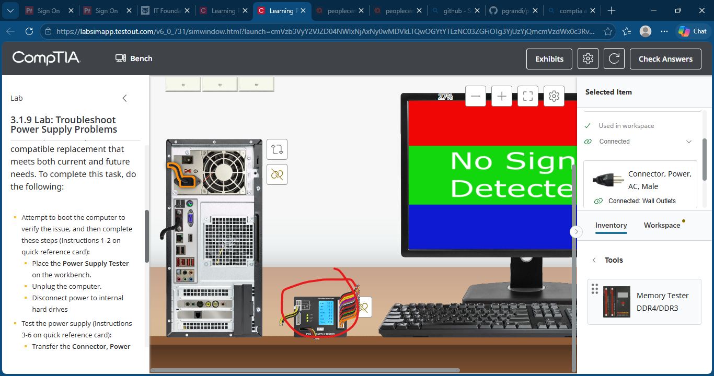

---

### 8. Remove the Defective PSU
Removed the faulty power supply from the computer.

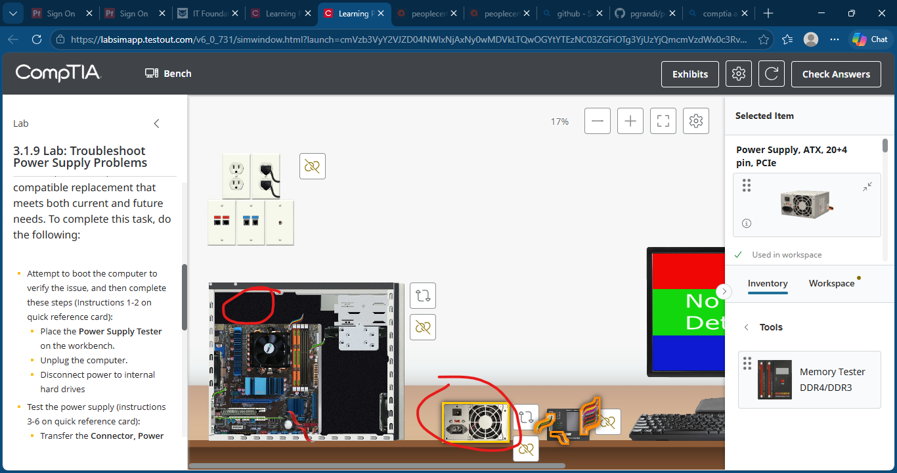

---

### 9. Install Replacement Power Supply
Installed a new ATX power supply with PCIe support for future upgrades.

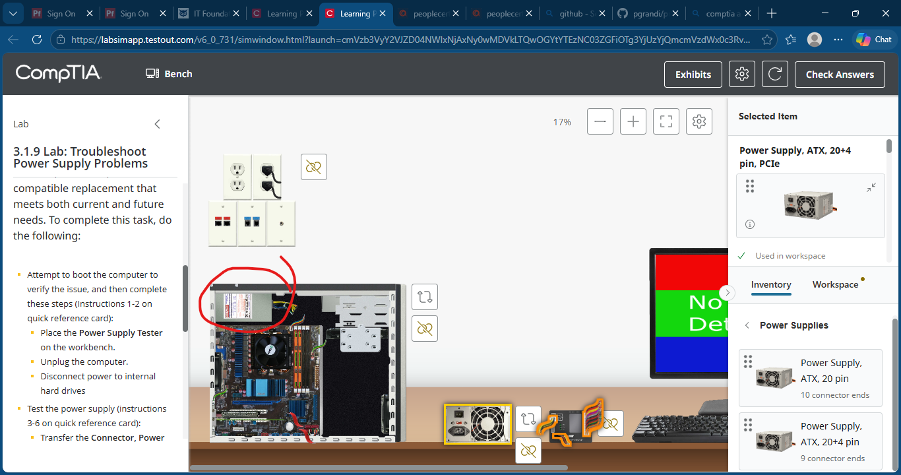

---

### 10. Reconnect Power Cables
Connected:
- 20+4-pin motherboard power connector
- 4-pin CPU power connector
- SATA power connectors

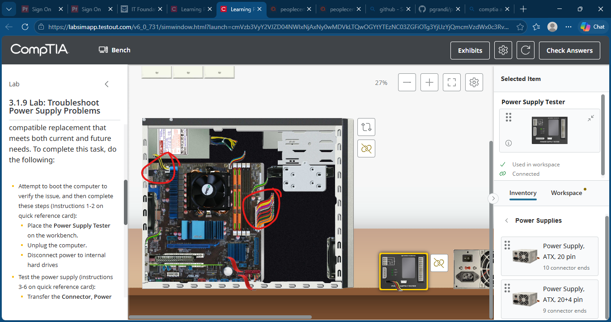

---

### 11. Restore AC Power
Connected the AC power cable to the replacement power supply.

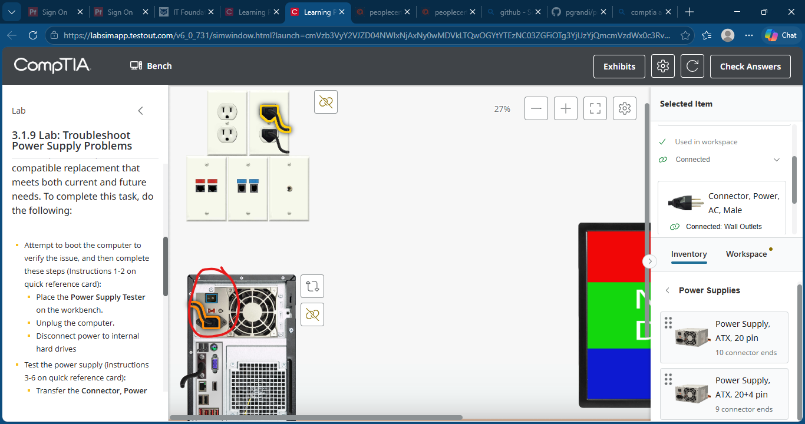

---

### 12. Verify Successful Startup
Powered on the computer and confirmed successful Windows startup.

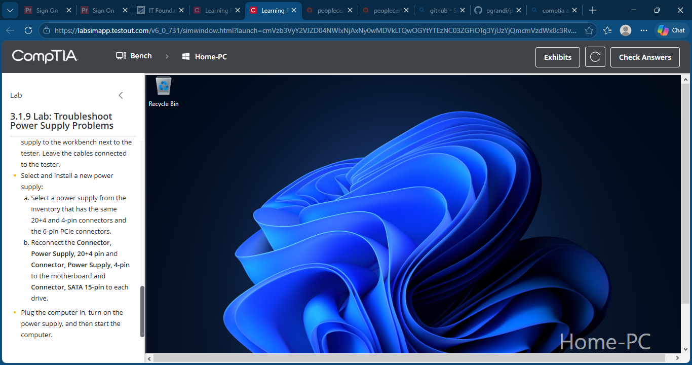

---

## Skills Demonstrated
- Power Supply Troubleshooting
- Power Supply Diagnostics
- Hardware Testing
- PSU Replacement
- ATX Power Connections
- CPU Power Connections
- SATA Power Connections
- Desktop PC Repair
- System Verification

---

## Outcome
Successfully diagnosed a failed power supply, replaced the defective unit, restored all required power connections, and verified successful system startup.