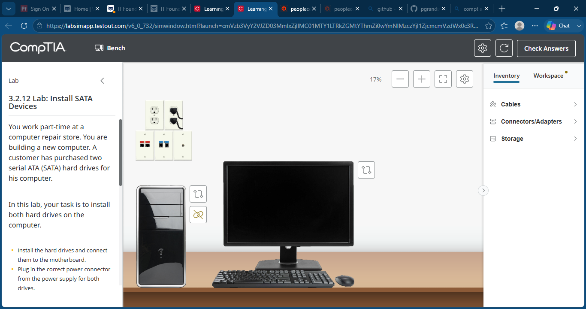
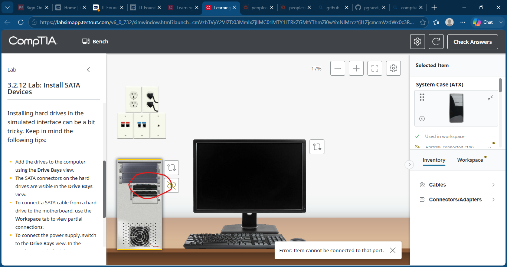
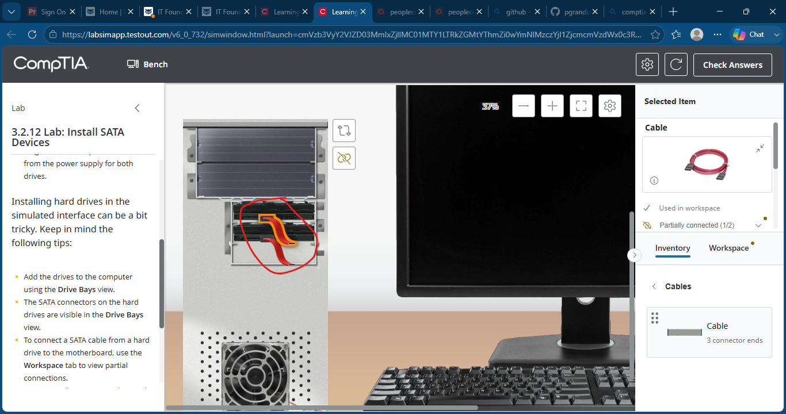
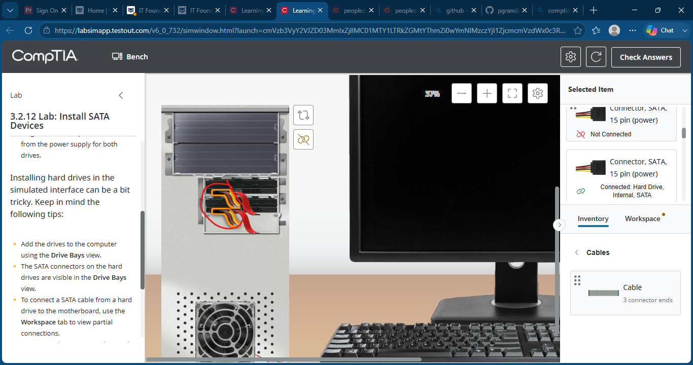
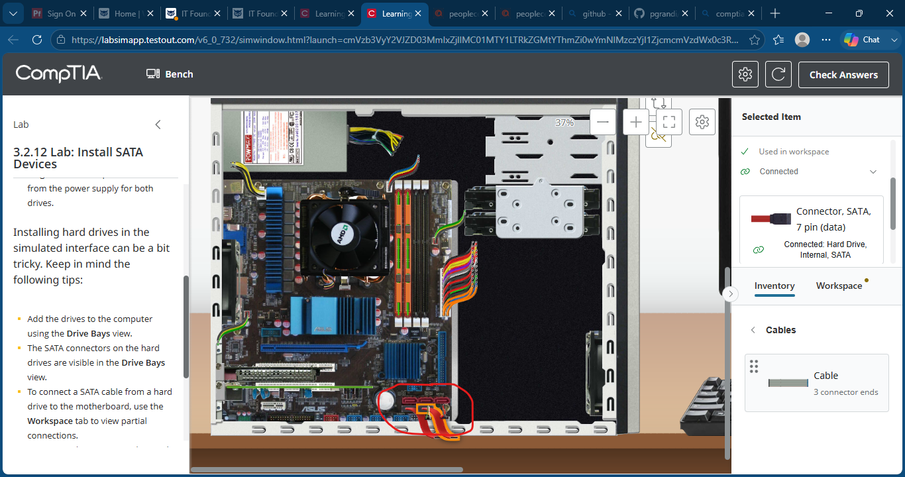
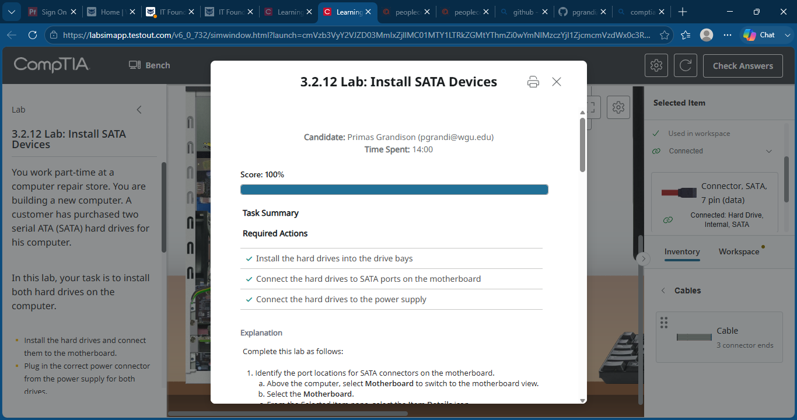

# Lab 13 - Install SATA Devices

## Objective

Install two SATA hard drives into a desktop computer, connect them to available SATA ports on the motherboard, and provide power from the power supply.

---

## Lab Overview

In this lab, I installed two SATA hard drives into the system chassis and connected both data and power cables. This exercise reinforced storage device installation procedures and SATA connectivity concepts commonly encountered in desktop support and PC hardware upgrades.

---

## Skills Demonstrated

- SATA Hard Drive Installation
- SATA Data Cable Connections
- SATA Power Connector Identification
- Motherboard SATA Port Configuration
- Internal Storage Device Installation
- Desktop Hardware Assembly
- PC Troubleshooting Fundamentals

---

## Tools & Technologies

- TestOut PC Pro
- SATA Hard Drives
- SATA Data Cables
- SATA Power Connectors
- ATX Desktop System
- Motherboard SATA Interface

---

## Screenshots

### Initial Lab Setup

### Install Hard Drives

### Connect SATA Data Cables

### Connect SATA Power Cables

### Connect Drives to Motherboard SATA Ports

### Lab Completed

---

## What I Learned

This lab strengthened my understanding of SATA storage installation procedures. I learned how SATA hard drives require both a SATA data connection to the motherboard and a SATA power connection from the power supply. I also practiced identifying motherboard SATA ports and properly connecting multiple storage devices within a desktop system.

---

## Outcome

Successfully installed two SATA hard drives, connected SATA data cables to motherboard SATA ports, connected SATA power connectors from the power supply, and completed the lab with a score of 100%.