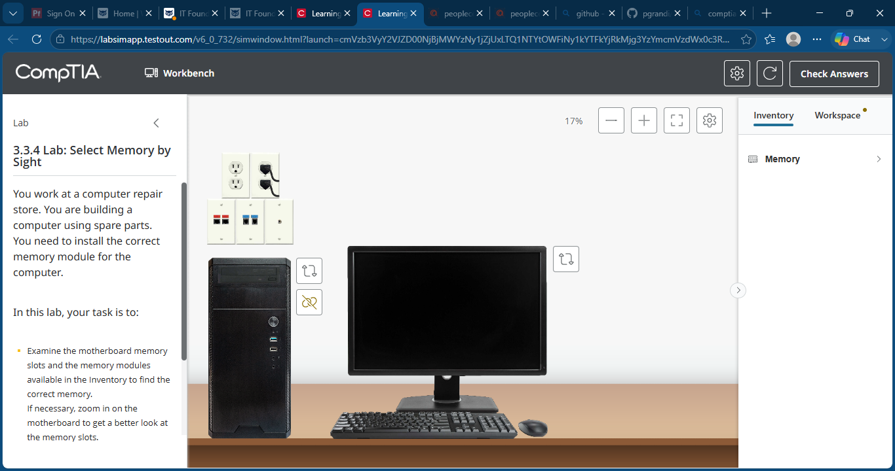
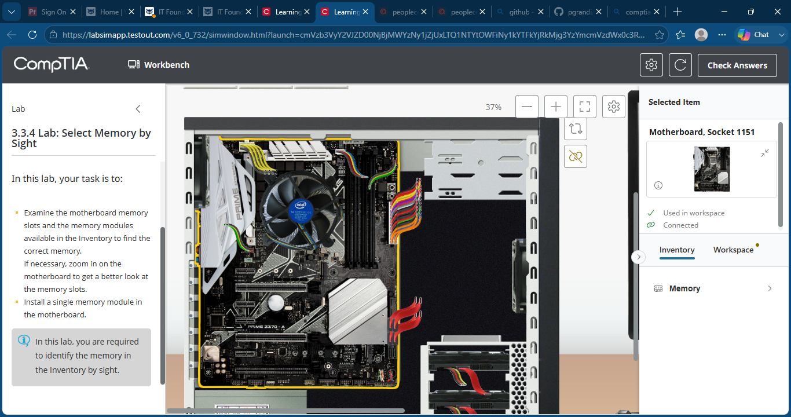
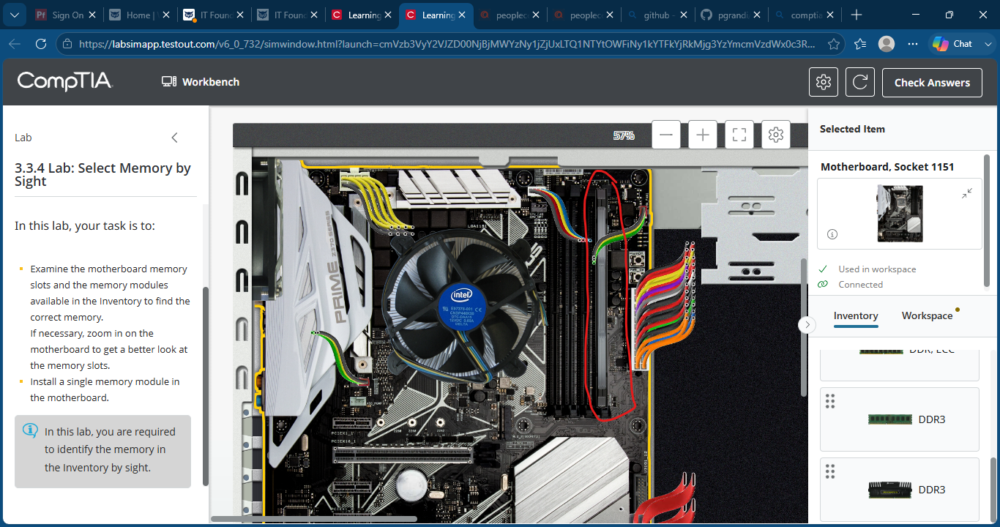
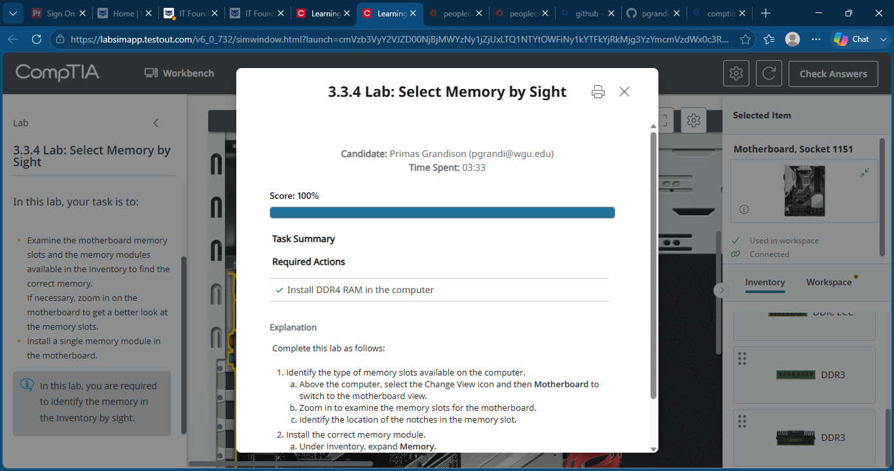

# Lab 14 - Select Memory by Sight

## Objective

Identify the correct memory module by examining the motherboard memory slots and install the appropriate RAM module into the system.

---

## Lab Overview

In this lab, I examined the motherboard memory slots to determine the correct RAM type required for the system. After identifying the appropriate memory module, I installed a DDR4 memory stick into the motherboard and verified successful completion of the installation.

---

## Skills Demonstrated

- RAM Identification
- DDR4 Memory Recognition
- Motherboard Component Identification
- Memory Slot Analysis
- Desktop Hardware Installation
- PC Assembly Fundamentals
- Hardware Compatibility Verification

---

## Tools & Technologies

- TestOut PC Pro
- DDR4 RAM Module
- ATX Desktop System
- Motherboard Memory Slots
- Desktop Hardware Components

---

## Screenshots

### Initial Lab Setup

### Examine Motherboard Memory Slots

### Install Correct Memory Module

### Lab Completed

---

## What I Learned

This lab reinforced the importance of identifying the correct RAM type before installation. By examining the physical characteristics of the motherboard memory slots and matching them to the correct memory module, I practiced a common hardware support task that helps prevent compatibility issues during system upgrades and repairs.

---

## Outcome

Successfully identified the correct DDR4 memory module, installed it into the motherboard, and completed the lab with a score of 100%.