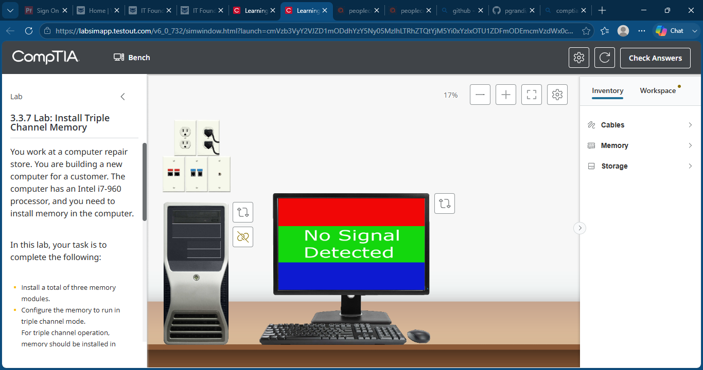
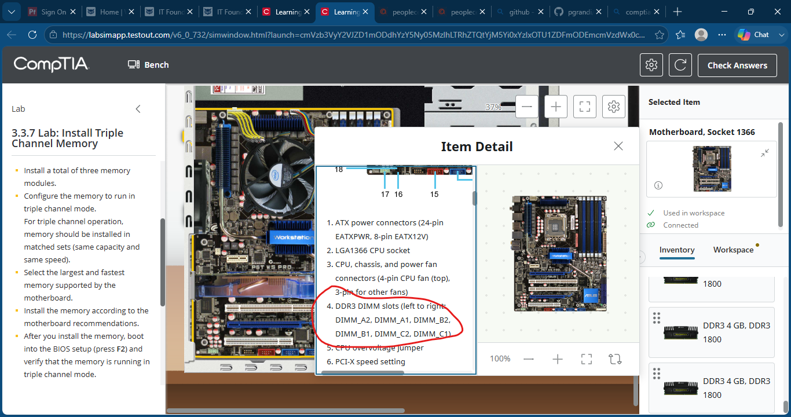
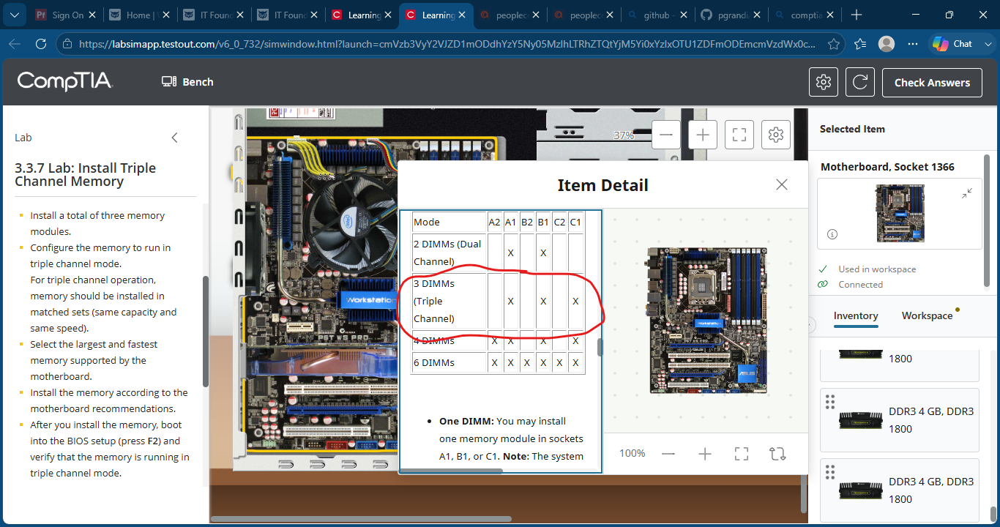
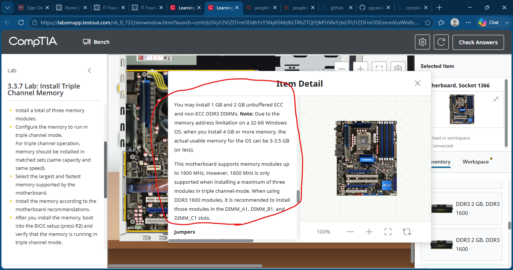
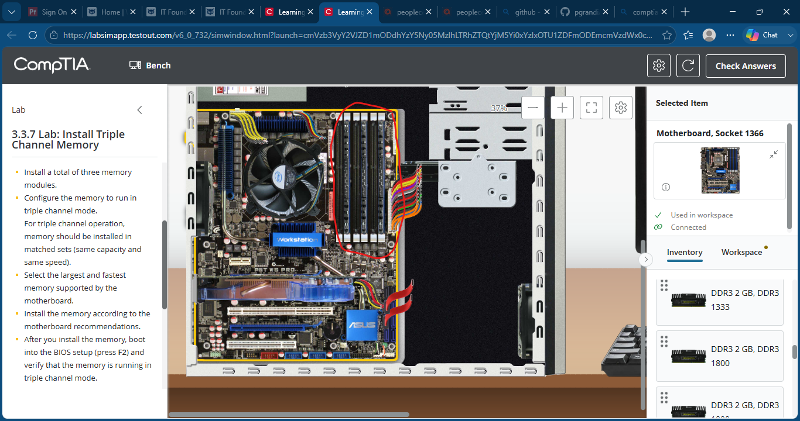
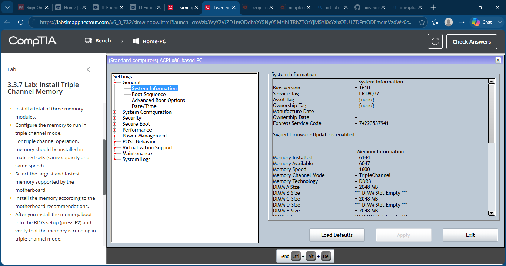
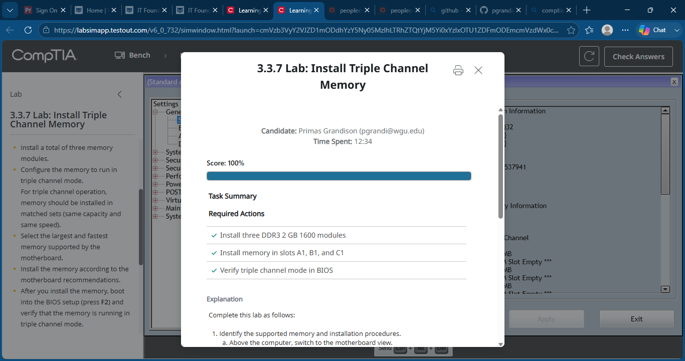

# Lab 15 - Install Triple Channel Memory

## Objective

Install three matching DDR3 memory modules, configure the motherboard for triple-channel memory operation, and verify proper memory configuration in BIOS.

---

## Lab Overview

In this lab, I reviewed motherboard documentation to identify the correct DIMM slots required for triple-channel memory operation. I selected three matching DDR3 memory modules, installed them in the recommended slots, booted into BIOS, and verified that the system detected the memory in triple-channel mode.

---

## Skills Demonstrated

- Triple-Channel Memory Configuration
- DDR3 Memory Installation
- Memory Compatibility Verification
- DIMM Slot Identification
- Motherboard Documentation Analysis
- BIOS Verification
- Hardware Installation and Configuration

---

## Tools & Technologies

- TestOut PC Pro
- DDR3 Memory Modules
- Intel Core i7 Platform
- Triple-Channel Memory Architecture
- BIOS System Configuration
- Desktop PC Hardware

---

## Screenshots

### Initial Lab Setup

### Review Motherboard Memory Information

### Triple-Channel Configuration Requirements

### Supported Memory Specifications

### Install Three Memory Modules

### Verify Triple-Channel Mode in BIOS

### Lab Completed

---

## What I Learned

This lab reinforced how memory channel architecture affects system performance and how motherboard documentation should be consulted before installing RAM. I learned how to identify the correct DIMM slots for triple-channel operation, select compatible memory modules, and verify memory configuration through BIOS system information.

---

## Outcome

Successfully installed three DDR3 1600 MHz memory modules in the correct DIMM slots (A1, B1, and C1), verified triple-channel memory operation in BIOS, and completed the lab with a score of 100%.