# Lab 16 - Troubleshoot Memory

## Objective

Diagnose a computer experiencing memory-related boot issues, identify defective RAM, replace failed memory modules, upgrade system memory to 8 GB, document corrective actions, and close the support ticket.

---

## Lab Overview

In this challenge lab, I worked as an IT Help Desk technician using a ticketing system to resolve a user's computer problem. The desktop computer emitted memory error beeps and would not boot properly. Using a memory testing device, I identified a failed RAM module, installed replacement memory, verified system functionality, documented the work performed, and closed the support ticket.

---

## Skills Demonstrated

- Memory Troubleshooting
- Hardware Diagnostics
- RAM Testing
- Fault Isolation
- Memory Replacement
- Customer Ticket Management
- Hardware Upgrades
- Problem Resolution Documentation
- Desktop Support Procedures

---

## Tools & Technologies

- TestOut PC Pro
- Issue Trax Ticketing System
- Memory Tester
- DDR3 Memory Modules
- Desktop PC Hardware
- BIOS Verification

---

## Screenshots

### Initial Lab Setup

### Open Ticketing System

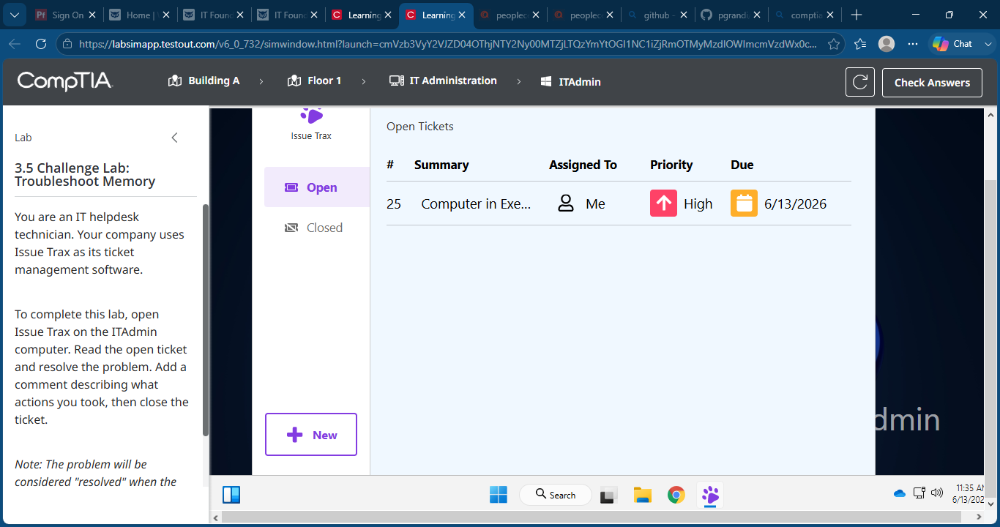

### Review Support Ticket

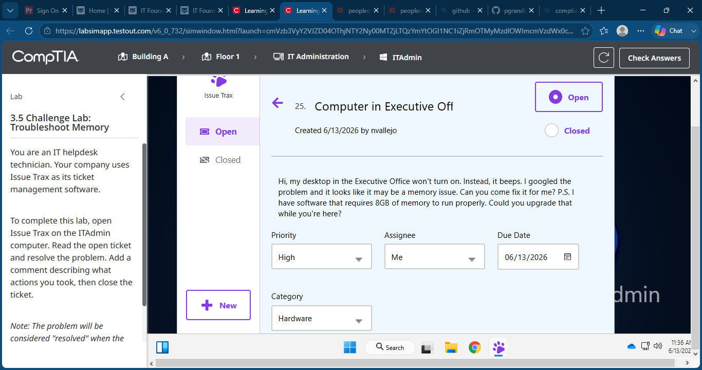

### Executive Office Computer

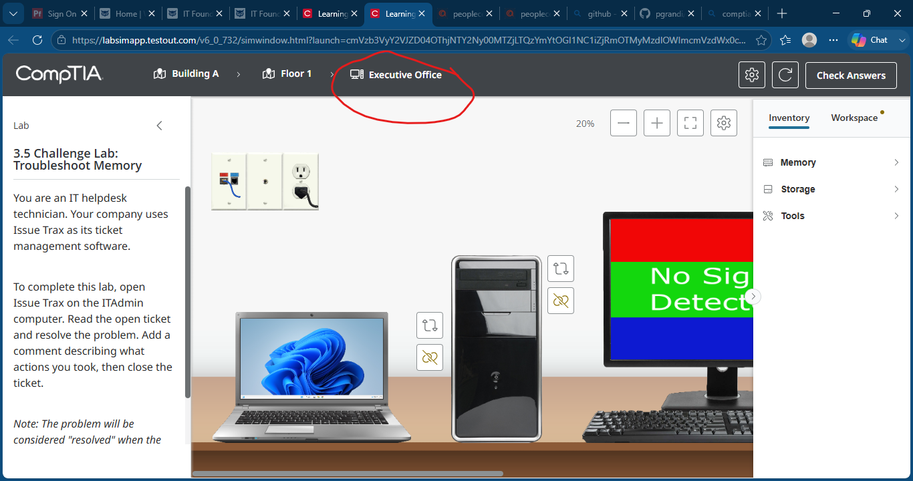

### Memory Tester

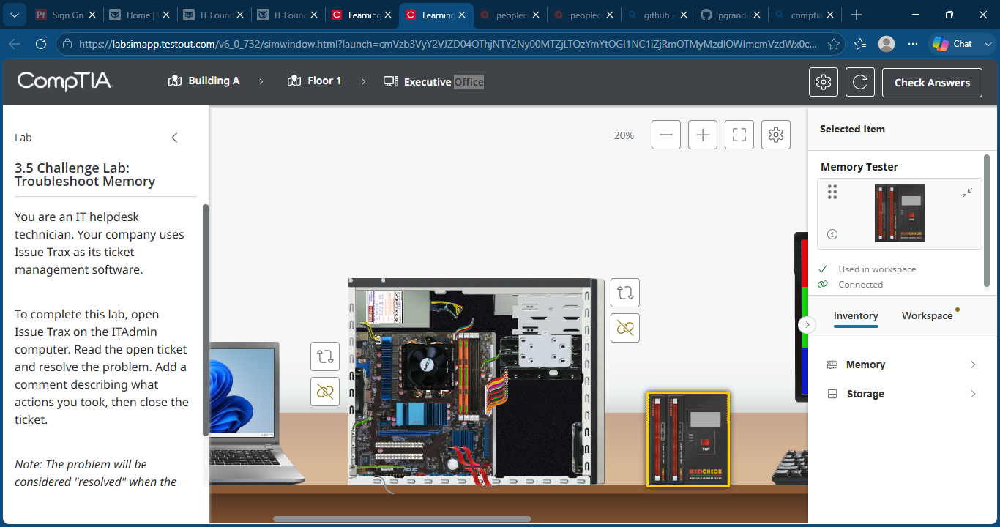

### First RAM Module Tests Good

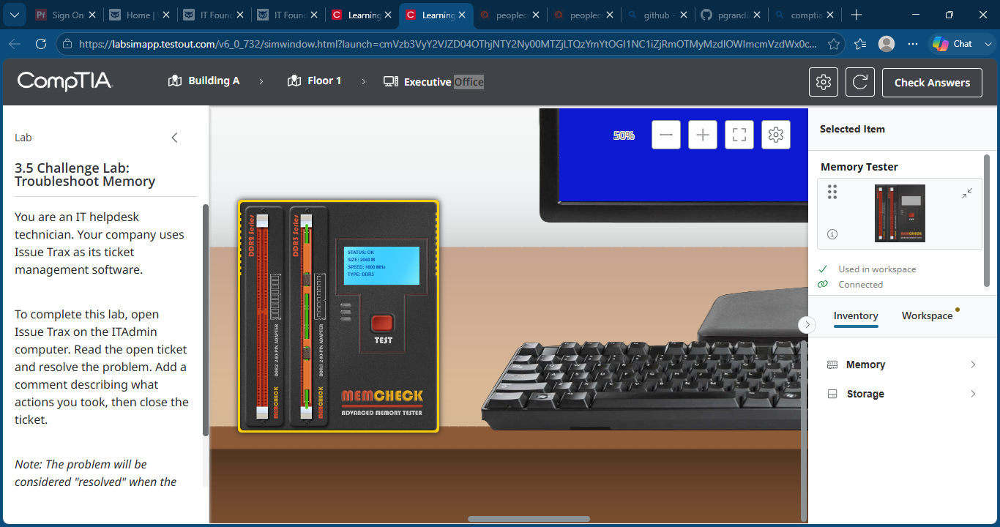

### Defective RAM Module Identified

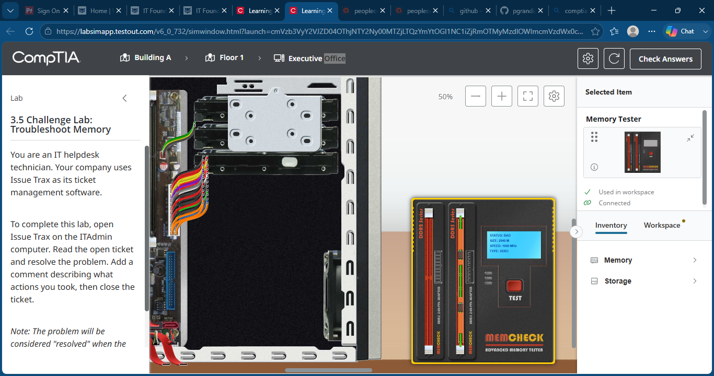

### Test Replacement Memory

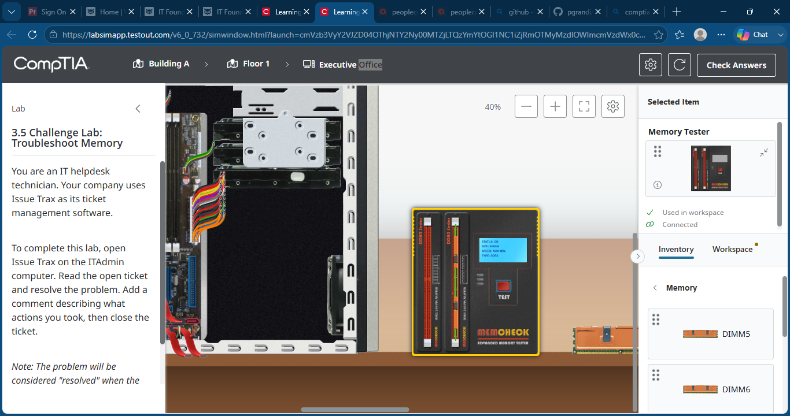

### Install New Memory Modules

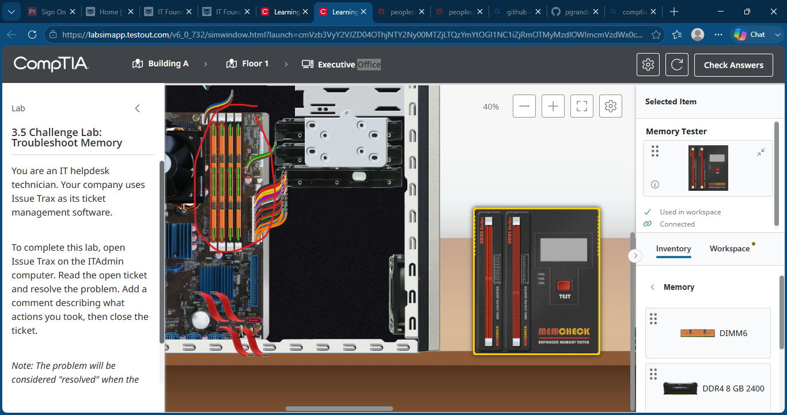

### Verify Successful Boot

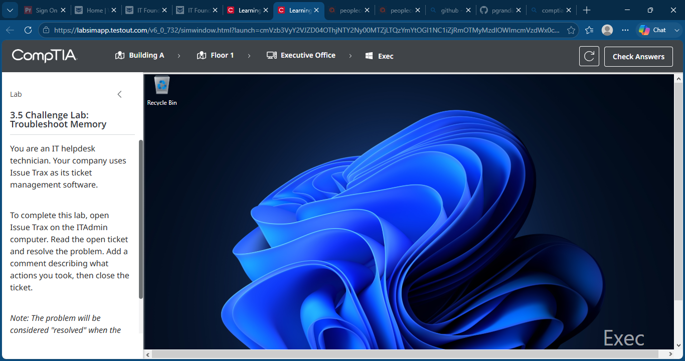

### Update Support Ticket

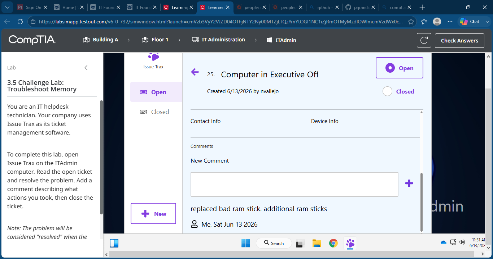

### Lab Completed

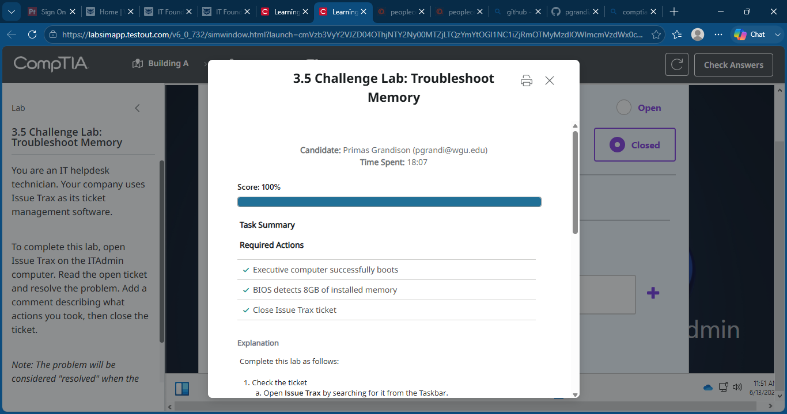

---

## What I Learned

This lab reinforced a structured troubleshooting process for hardware failures. I practiced reviewing support tickets, identifying symptoms, testing RAM modules individually, replacing failed components, validating repairs, documenting actions taken, and closing support requests. The exercise closely mirrors real-world desktop support workflows.

---

## Outcome

Successfully diagnosed a defective RAM module, upgraded the system to 8 GB of memory, verified successful boot operation, documented corrective actions in the ticketing system, and completed the lab with a score of 100%.