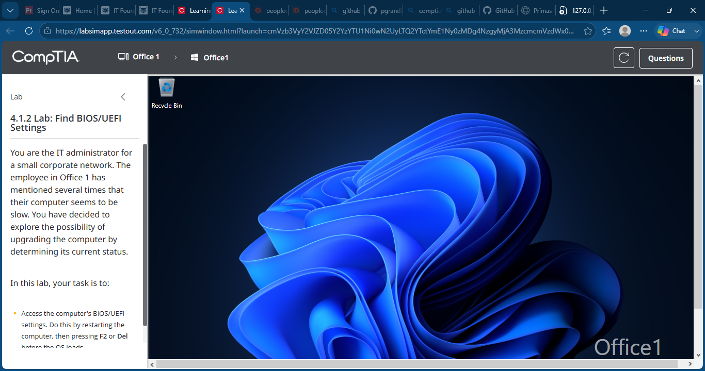
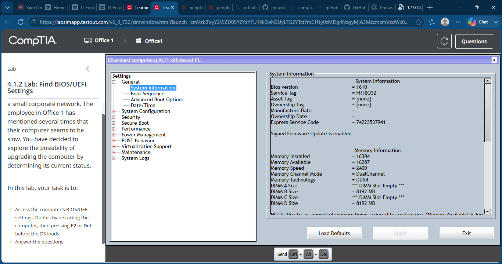
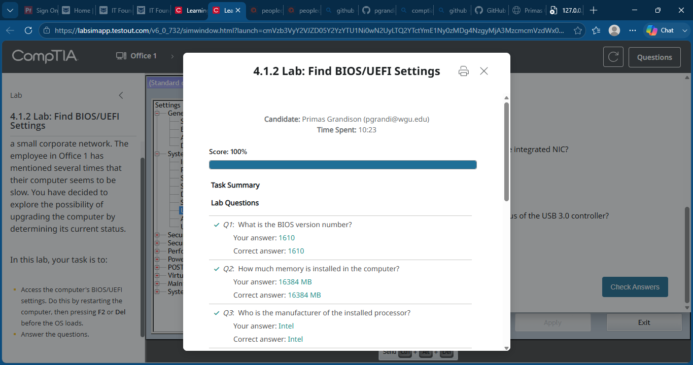

# Lab 17 - Find BIOS/UEFI Settings

## Objective

Access the computer's BIOS/UEFI firmware settings and identify key system information including BIOS version, installed memory, processor information, and hardware configuration settings.

---

## Lab Overview

In this lab, I accessed the BIOS/UEFI firmware interface to gather system information and answer configuration-related questions. I reviewed hardware details including BIOS version, memory configuration, processor manufacturer, and system settings commonly used during hardware upgrades and troubleshooting.

---

## Skills Demonstrated

- BIOS/UEFI Navigation
- Firmware Configuration
- Hardware Information Gathering
- System Configuration Review
- Memory Verification
- Processor Identification
- Desktop Support Fundamentals

---

## Tools & Technologies

- TestOut PC Pro
- BIOS/UEFI Firmware Interface
- System Information Utility
- Desktop PC Hardware
- Hardware Configuration Settings

---

## Screenshots

### Initial Lab Setup

### Access BIOS/UEFI Settings

### Lab Completed

---

## What I Learned

This lab reinforced how to access and navigate BIOS/UEFI firmware settings to obtain important system information. I practiced locating hardware configuration details such as BIOS version, installed memory, processor information, and system settings that are frequently referenced during troubleshooting, upgrades, and system administration tasks.

---

## Outcome

Successfully accessed the BIOS/UEFI interface, gathered required system information, answered all lab questions correctly, and completed the lab with a score of 100%.