## 21 - Troubleshoot a Malfunctioning Computer

**Objective:** Diagnose and repair a desktop computer that fails to boot by testing hardware components, replacing failed parts, and restoring normal system operation.

### Skills Demonstrated
- Performed power supply diagnostics using a PSU tester
- Identified abnormal voltage readings indicating PSU failure
- Removed and replaced a faulty ATX power supply
- Reconnected motherboard, GPU, and SATA power connections
- Diagnosed memory-related POST failures using a memory tester
- Identified defective DDR3 memory modules
- Replaced failed RAM with compatible memory
- Verified successful POST and Windows boot sequence
- Applied systematic hardware troubleshooting methodology
- Validated system functionality after hardware replacement

### Screenshots

#### Initial System State
.png)

#### Testing the Power Supply
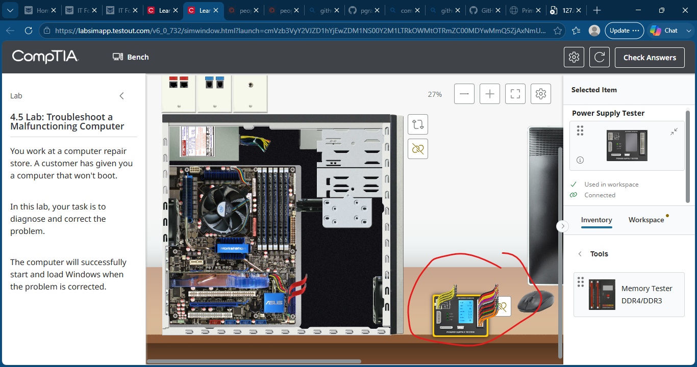

#### Faulty Power Supply Detected
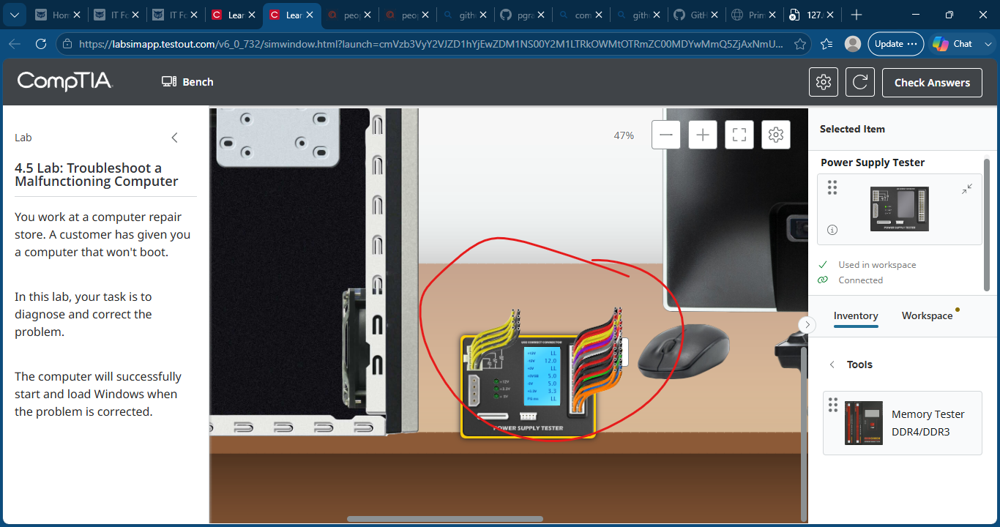

#### Disconnecting Power Connections
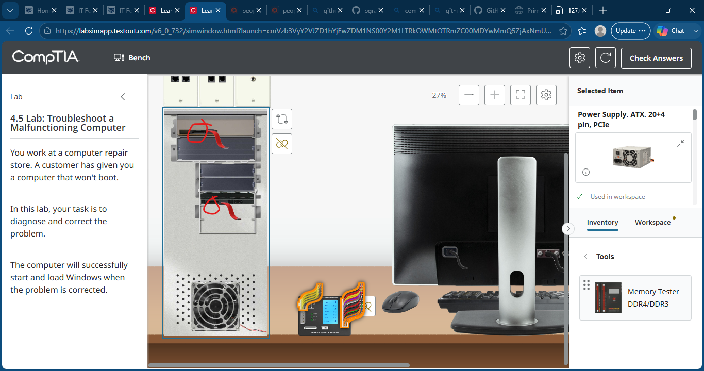

#### Disconnecting GPU Power
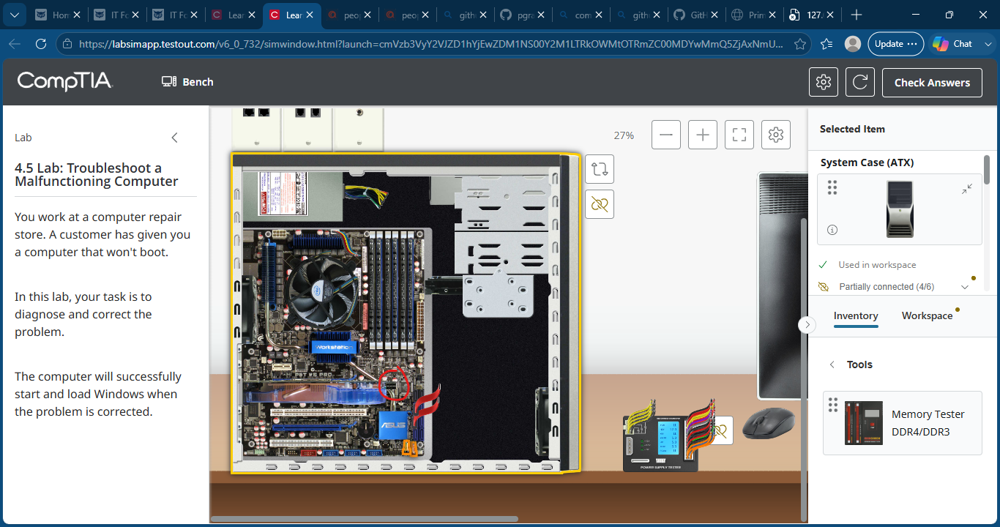

#### Removing AC Power
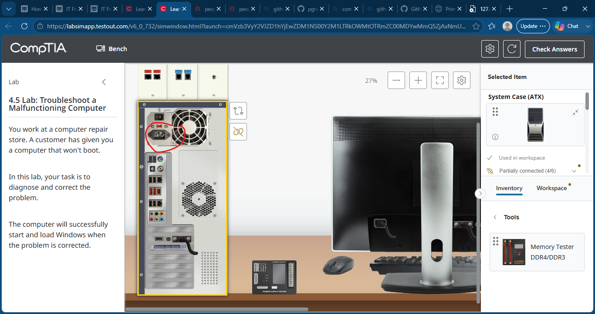

#### Removing Faulty Power Supply
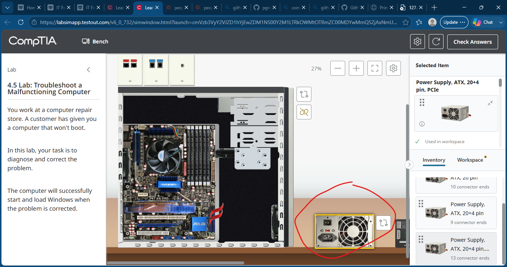

#### Installing Replacement Power Supply
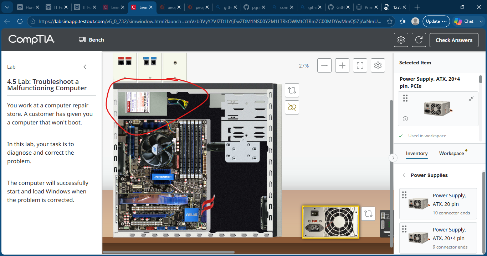

#### Reconnecting Motherboard and GPU Power
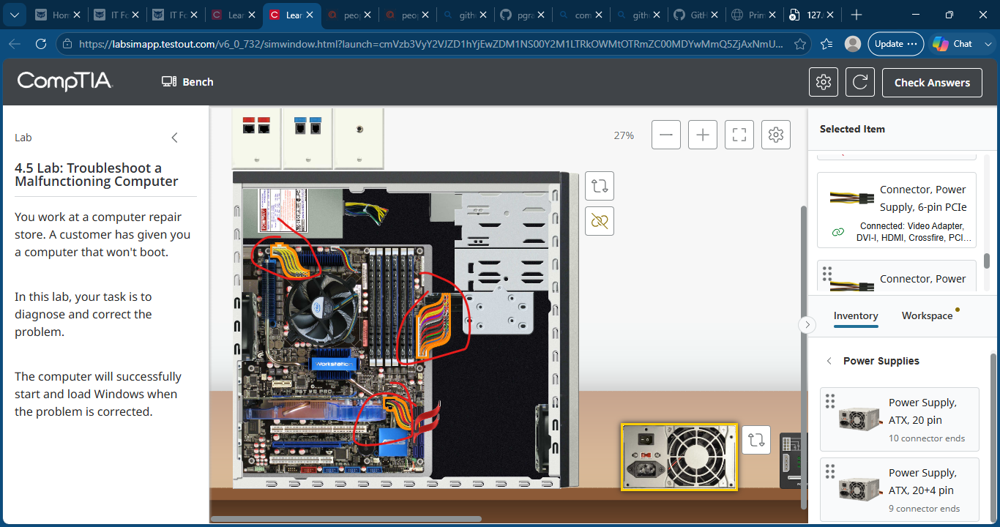

#### Reconnecting SATA Power
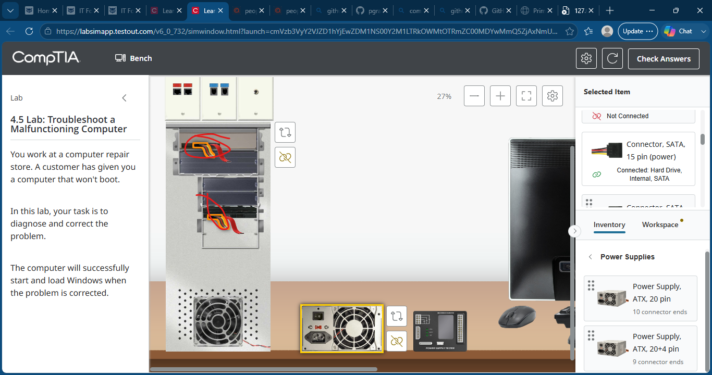

#### Memory Diagnostics Reveal Faulty RAM
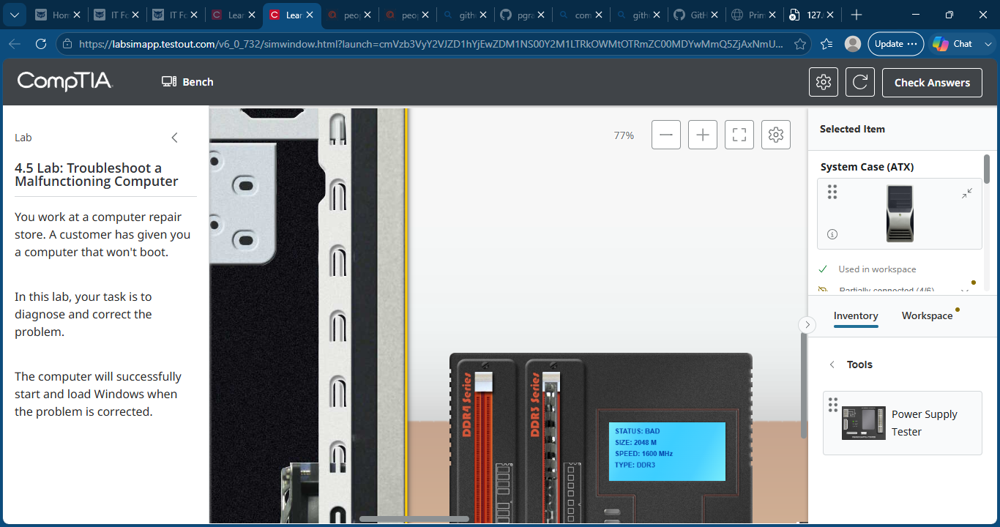

#### Installing Replacement Memory
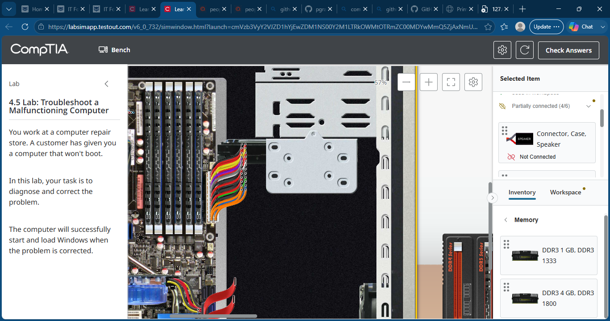

#### System Successfully Boots
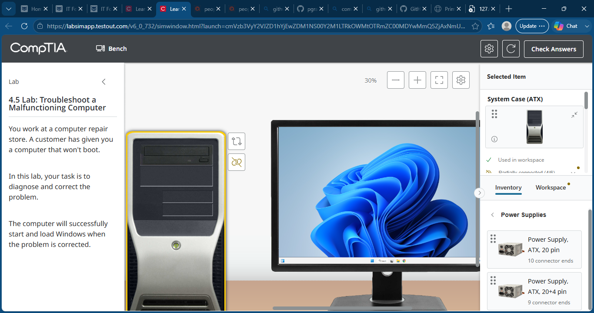

#### Lab Completion
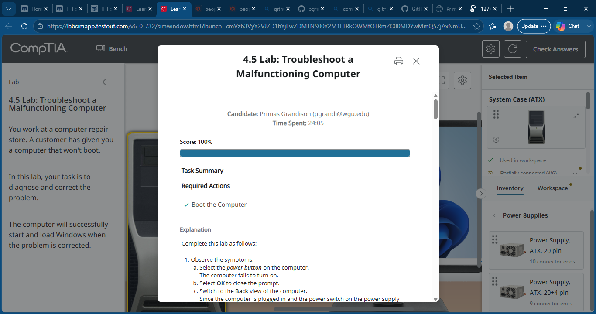

### Outcome
Successfully diagnosed multiple hardware failures by identifying a defective power supply and faulty DDR3 memory module. Replaced both components, restored system functionality, and verified a successful Windows boot.

