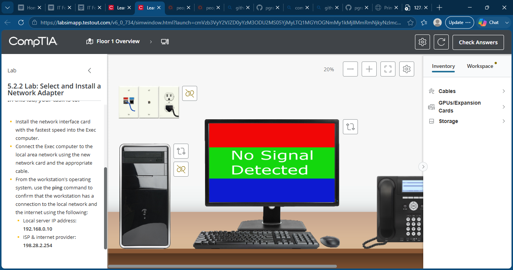
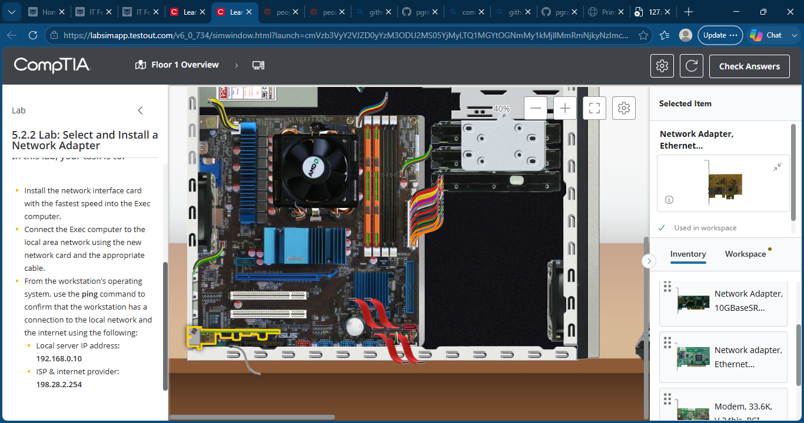
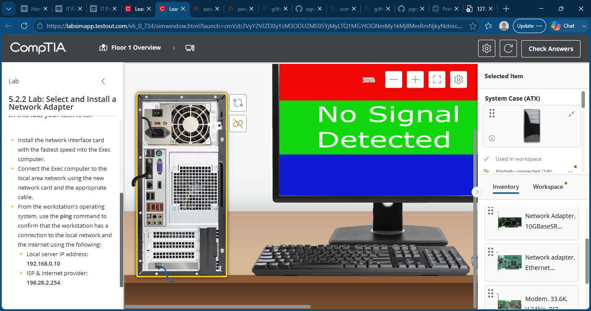
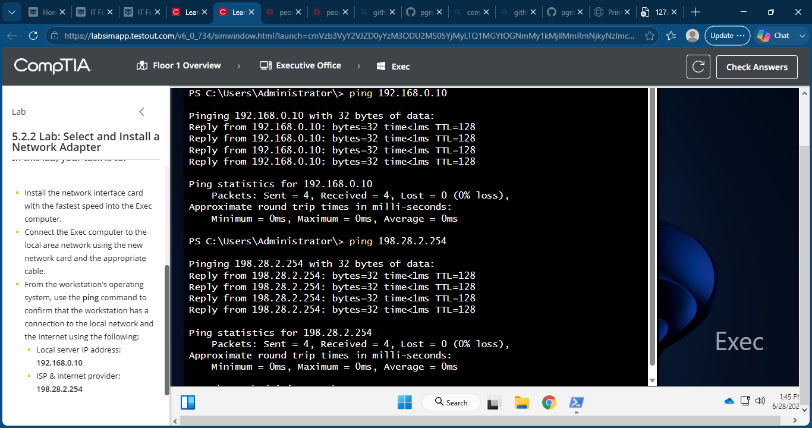
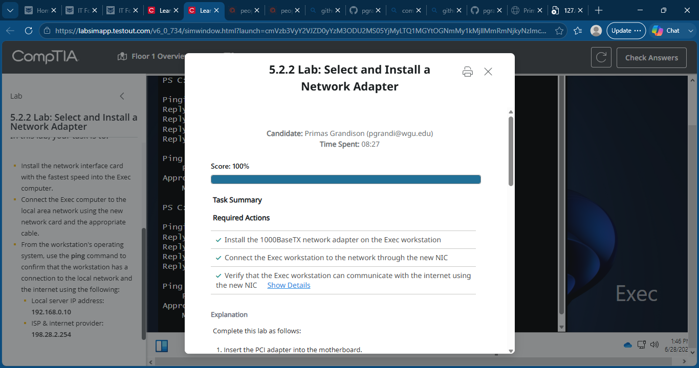

# 26 - Select and Install a Network Adapter

## Objective
Install the fastest available PCIe Ethernet network adapter, reconnect the workstation to the network through the new NIC, and verify successful communication with both the local network and the internet.

## Skills Demonstrated
- Installed a PCIe Ethernet network adapter
- Selected the fastest available network interface
- Connected Ethernet cabling to the new NIC
- Verified physical network connectivity
- Used PowerShell for network diagnostics
- Tested LAN connectivity with ping
- Tested Internet connectivity with ping
- Desktop hardware installation
- Basic network troubleshooting

## Lab Steps

1. Opened the Exec workstation.
2. Installed the 1000BaseTX PCIe Ethernet network adapter into an available PCIe slot.
3. Moved the Ethernet cable from the onboard NIC to the new PCIe network adapter.
4. Powered on the workstation.
5. Opened PowerShell as Administrator.
6. Verified connectivity to the local server:

```powershell
ping 192.168.0.10
```

7. Verified internet connectivity:

```powershell
ping 198.28.2.254
```

8. Confirmed successful replies from both destinations with 0% packet loss.

## Commands Used

```powershell
ping 192.168.0.10
ping 198.28.2.254
```

## Key Takeaways

- Installed a PCIe network adapter to upgrade network connectivity.
- Reconnected the workstation to use the new NIC.
- Verified successful LAN and internet communication using ICMP ping tests.
- Practiced installing expansion cards and validating network functionality after hardware upgrades.

## Screenshots

### Lab Overview


### Install Network Adapter


### Connect Ethernet Cable to New NIC


### Verify Connectivity with PowerShell


### Lab Completed
