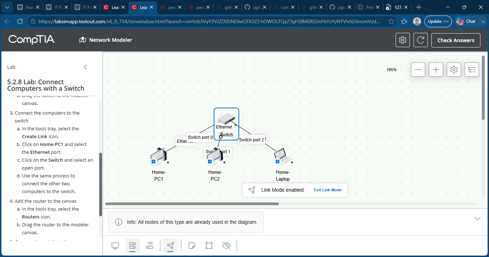
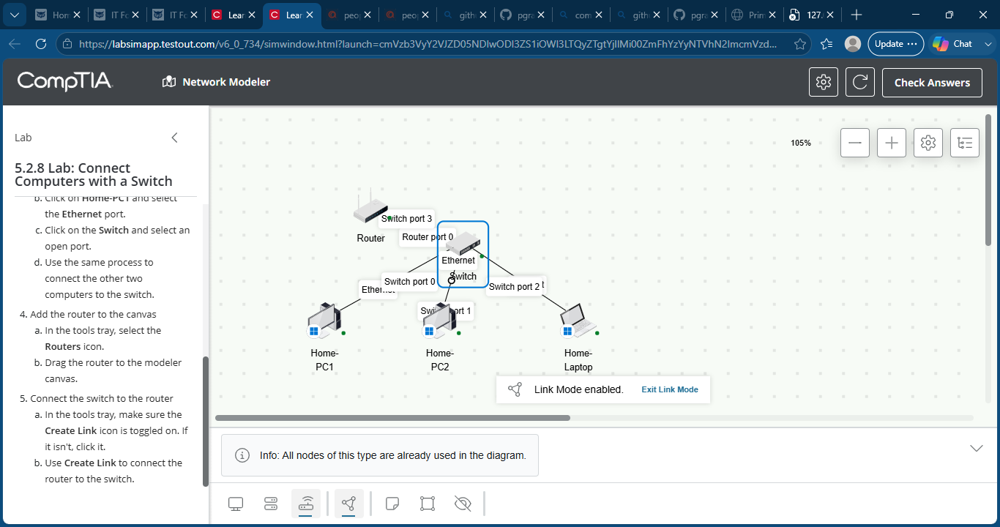
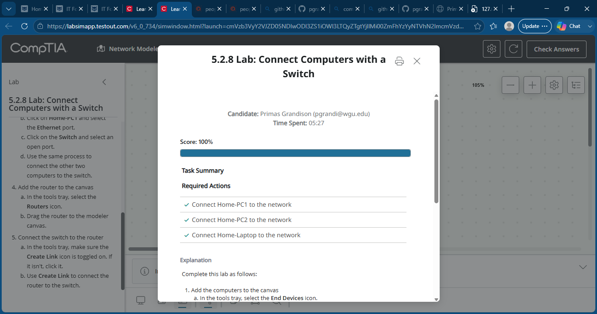

# 28 - Connect Computers with a Switch

## Objective

Build a basic Ethernet local area network (LAN) by connecting multiple computers to a network switch, connecting the switch to a router, and creating a functional network topology using the TestOut Network Modeler.

## Skills Demonstrated

- Ethernet switch configuration
- Router-to-switch connectivity
- LAN topology design
- End device connectivity
- Network infrastructure planning
- Network modeling
- Ethernet networking
- Basic enterprise networking
- Physical network layout
- Network troubleshooting fundamentals

## Lab Steps

1. Added an Ethernet switch to the network model.
2. Connected Home-PC1 to Switch Port 0.
3. Connected Home-PC2 to Switch Port 1.
4. Connected Home-Laptop to Switch Port 2.
5. Added a router to the network topology.
6. Connected the router to Switch Port 3.
7. Verified all devices were properly connected and the network topology was complete.

## Key Takeaways

- Connected multiple client devices through an Ethernet switch.
- Expanded the network by connecting a router to the switch.
- Practiced creating a simple LAN topology.
- Reinforced the role of switches in local networks and routers in connecting networks.
- Gained experience using the TestOut Network Modeler to build network infrastructure.

## Screenshots

### Computers Connected to Switch

### Router Connected to Switch

### Lab Complete
