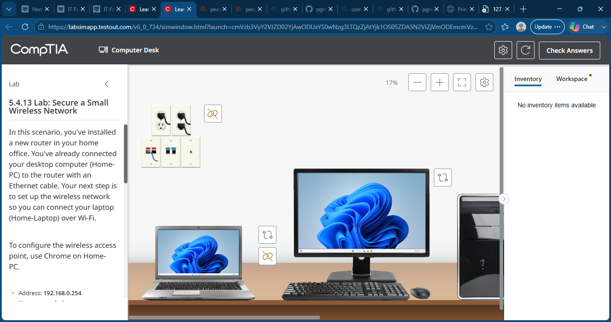
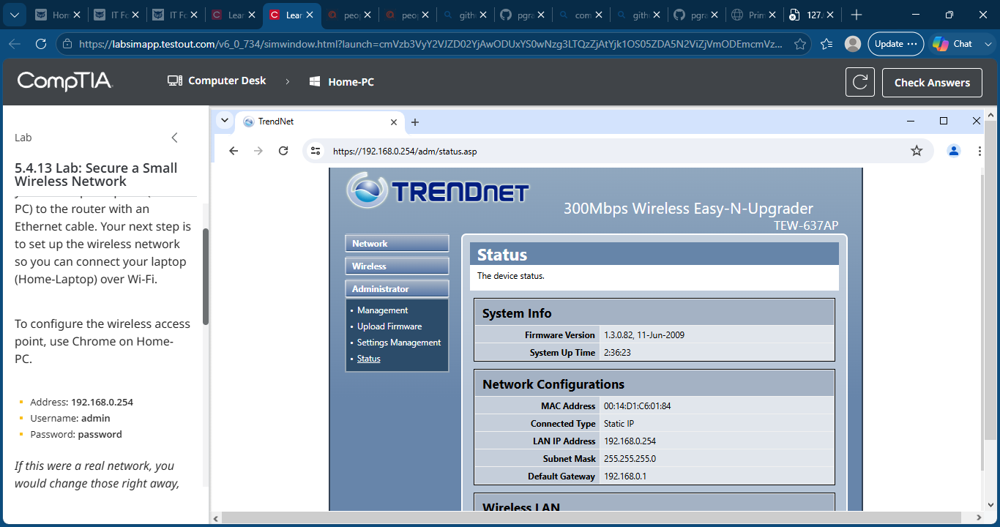
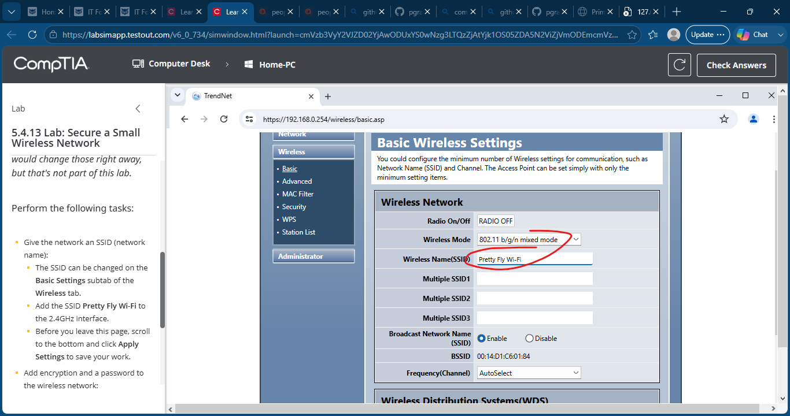
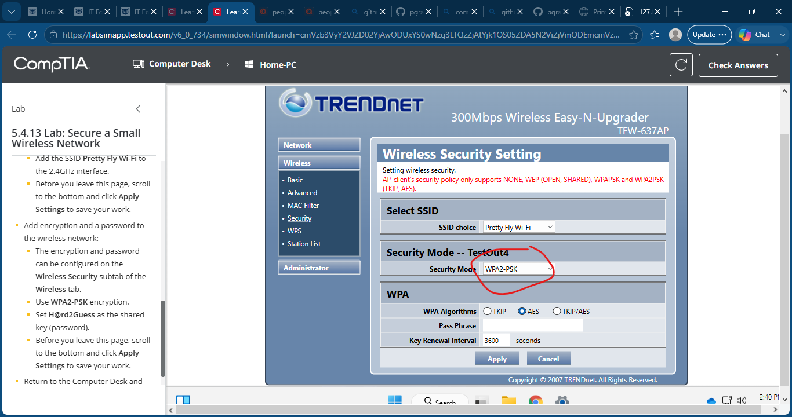
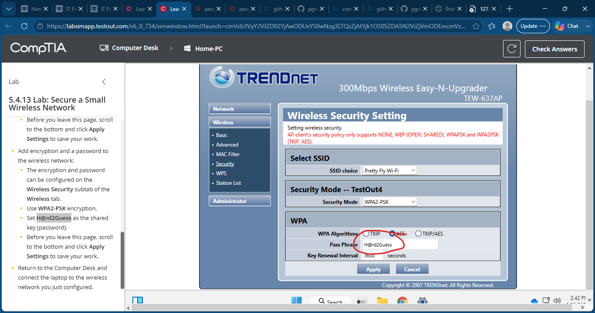
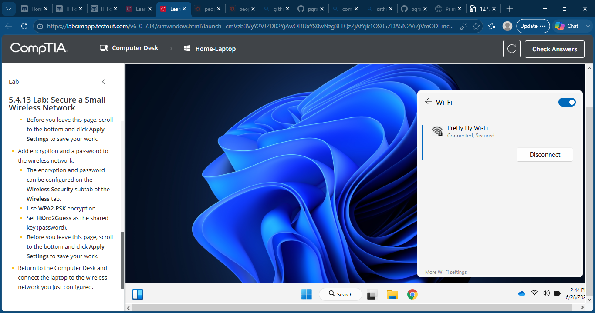
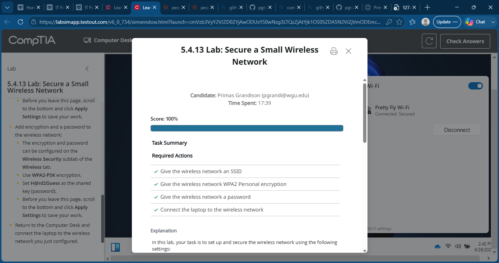

# 29 - Secure a Small Wireless Network

## Objective

Configure and secure a wireless access point by assigning a wireless network name (SSID), enabling WPA2-Personal encryption, configuring a secure passphrase, and connecting a laptop to the protected wireless network.

## Skills Demonstrated

- Configured a wireless access point
- Assigned a wireless SSID
- Configured WPA2-Personal (WPA2-PSK) security
- Created a secure wireless passphrase
- Applied wireless security settings
- Connected a wireless client to a secured network
- Verified secure Wi-Fi connectivity
- Web-based router administration
- Home network security
- Wireless networking fundamentals

## Lab Steps

1. Logged into the wireless access point management interface.
2. Navigated to the Wireless Basic Settings page.
3. Configured the wireless network name (SSID) as:

```
Pretty Fly Wi-Fi
```

4. Applied the wireless configuration.
5. Opened the Wireless Security settings.
6. Selected **WPA2-PSK** as the security mode.
7. Configured the wireless passphrase as:

```
H@rd2Guess
```

8. Applied the wireless security settings.
9. Connected the Home-Laptop to the newly secured wireless network.
10. Verified the laptop successfully connected to the secured Wi-Fi network.

## Key Takeaways

- Configured a wireless network using a custom SSID.
- Secured the wireless network with WPA2-Personal encryption.
- Created a strong wireless passphrase to protect network access.
- Connected a client device to a secured wireless network.
- Practiced common wireless security tasks performed by IT support technicians.

## Screenshots

### Lab Overview


### Router Management Interface


### Configure SSID


### Configure WPA2 Security


### Configure Wireless Password


### Connect Laptop to Wireless Network


### Lab Complete
